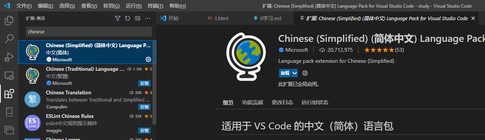
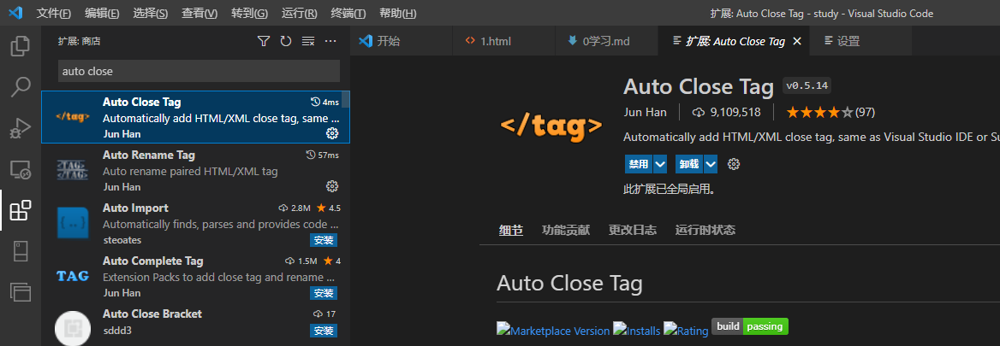
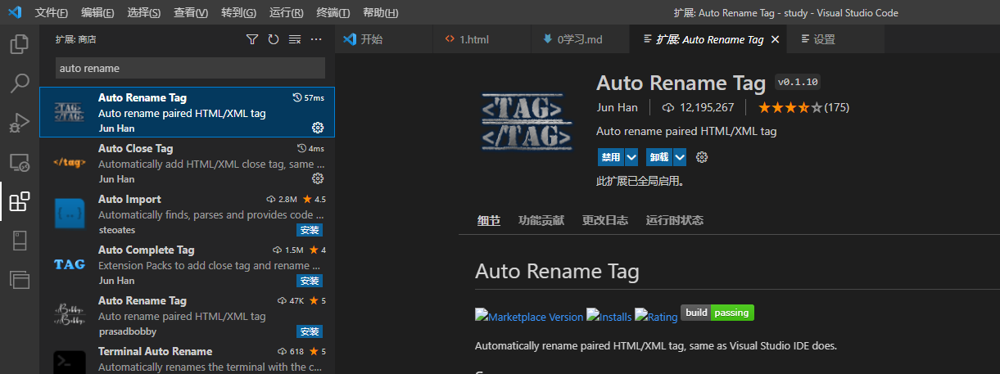
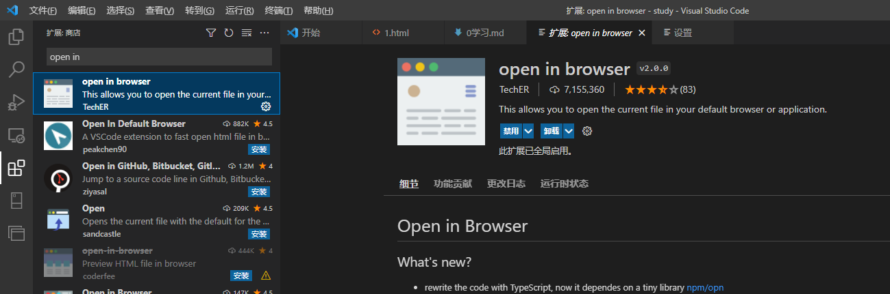
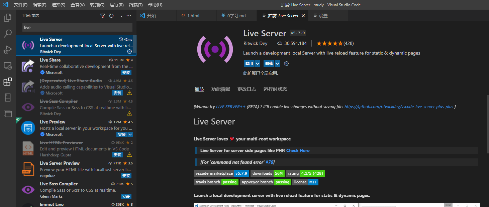

# day-001-one-20230206-学习笔记网站及前端准备工作及基础html内容及一些基础标签

## 学习方式

1. 上课，不懂的就记就问。如果当天晚上12点不懂，就代表有问题。
2. 练习，上课退微信，写好之后就重写一遍。
3. 作业。
4. 复习，当天晚上复习。周四复习周一到周三，以及之前。周日复习周五到周六，以及之前。以及精简之前内容。复习不可看视频。写md文档放到网上。

## 上课时间

周四、周日休息，其它时间上课  
上午9:30 到 13:00;下午15:00 到 18:00  
晚自习：19:00 到 20:30(强制性上晚自习，晚自习不讲课，主要是课程辅导，练习作业/面试题/随堂小练习)  

## 开始准备工作

### 笔记

Markdown: 用VSCode，教程用<https://www.runoob.com/markdown/md-table.html>。

- 个人推荐这个，配合[github.dev](https://docs.github.com/en/codespaces/the-githubdev-web-based-editor)。
  - 基本上和本地Markdown差不多，而md文档又可以本地配合github使用，还可以在csdn及稀土掘金之类的使用，更可以自己建个人博客。
  - 至于图片，放在该md文档的同一个目录下，都用相对路径来取，方便后来人复制并且打包带走。

印象笔记-马克飞象： <https://maxiang.io/>  可以用，相当于付费商用的Markdown

语雀： <https://www.yuque.com/dashboard> 可以试着用，类似于博客吧

### 下载浏览器

官网: <https://www.google.cn/intl/zh-CN/chrome/>
不用翻墙: <http://www.downcc.com/soft/1158.html>

### 设置谷歌浏览器为默认浏览器

### 下载VSCode

#### 软件本体

官网： <https://code.visualstudio.com/>

#### 下载VSCode插件

VSCode汉化插件-Chinese (Simplified) (简体中文) Language Pack for Visual Studio Code


自动闭合标签-Auto Close Tag


自动重命名成对的标签-Auto Rename Tag，自动重命名成对的HTML/XML标签。


打开浏览器-open in browser，可以直接右键打开html文件。


小型服务器-Live Server-和open in browser差不多,不过它可以实时更新对应的html


## 基础HTML

### 双标签与自闭合标签

1. HTML 标签是由尖括号包围的关键词。
2. 成对出现的，就是双标签。标签中的第一个标签是开始标签，第二个标签是结束标签也叫闭合标签，如`<div></div>`。
3. 只有一个的，则叫单标签。如`<br/>`或``。

### 注释标签

1. html注释就是html中对某一块内容的解释，但是不会被浏览器编译。
    - `<!-- html注释 -->`。
2. 注释的快捷键  `ctrl`+`/`  或者 `ctrl`+`shift`+`/`。

### HTML网页框架

快捷创建网页框架-可以默写，了解里面的各个含义

```html
<!-- 文档类型指令，快捷键 !+tab 或 !+enter -->
<!DOCTYPE html>
<!-- html页面主结构,lang表示语言属性 -->
<html lang="en">
  <head>
    <!-- charset表示语言集; UTF-8万国码，其它的如gbk之类的中文码没必要用，可能会有乱七八糟的错。 -->
    <meta charset="UTF-8" />
    <title>文档标签页上的文字</title>
  </head>
  <body>
  页面主体内容
  </body>
</html>
```

### 标签规范

1. 尽量减少标签层级
2. 双标签必须闭合。单标签用斜线闭合，并且一律统一标签结尾斜杠的书写形式。

### 标签属性

标签属性-分为内置属性和自定义属性 --> 进阶为es5标准的自定义组件`Web Components`。

- 内置属性是自带的，里面可以设置各种功能。
- 自定义属性是自己写的，一般只用于记录一些数据。

结构说明

- `lang="en"`  : `键值对`。
- `lang` : `属性名`/`key`/`键`。
- `"en"` : `属性值`/`value`/`值`。

### 标签关系

- 嵌套关系、父子关系
  - 实际上就是包含关系，标签A位于闭合标签

并列关系、兄弟关系

## 常见标签

### 常用标签

1. `<p></p>`段落标签，用于段落，段落有间隔，一般用于显示。样式其实也可以都只用div。
2. `<h1></h1>`到`<h6></h6>`标题标签，一般仅`标题`和`logo`用，一般也只用到`<h1></h1>`到`<h3></h3>`。
3. `<br/>`换行标签，一般在`<div></div`>或`<p></p>`标签内部用于换行时用。
4. `<hr/>`分割线标签，一般在`<div></div`>与`<p></p>`标签之间用。
5. ``图片标签。
      - `src`，图片的地址。
      - `alt`，图片加载失败后显示的文本。
      - `title`，移动到图片上提示的图片标签文字。

      ```html
      
      ```

6. `<a></a>`超链接标签

    - `href="本地或线上文档地址#锚点标签id名"`  : 就直接可以跳转到想要的地方。
    - `target="链接打开的窗口"` : 控制所点击链接打开的新窗口位置。
        - `target="_self"` : 默认，在当前窗口上打开链接。
        - `target="_blank"` : 在新的空白窗口上打开新链接。

    ```html
      <a href="https://www.baidu.com">跳转到外部链接</a>
      <a href="./2我的第二个页面.html">跳转到内部链接</a>
      <a href="#">重新加载本页并回到顶部</a>
      <a href="javascript:;">占位不做操作javascript:;</a>
      <a href="./2我的第二个页面.html#锚点标签id名顶部">锚点标签id名顶部</a>
    ```

7. `<div></div>`大盒子标签
    `<div></div>`文档分区元素是一个通用型的流内容容器，在不使用CSS的情况下，其对内容或布局没有任何影响。
8. `<span></span>`小盒子标签
    `<span></span>`通用行内容器，并没有任何特殊语义。可以使用它来编组元素以达到某种样式意图（通过使用类或者 Id 属性），或者这些元素有着共同的属性，比如lang。
    - 在其他语义化标签不适用的情况下再使用。
9. 三大列表

    - `<ol></ol>`与`<li></li>`: 组成有序列表。
    - `<ul></ul>`与`<li></li>`: 组成无序列表。
    - `<dl></dl>`与`<dt></dt>`类名/`<dd></dd>`项目: 组成自定义列表。

10. 格式化标签

    - `<strong></strong>`加粗标签
    - `<b></b>`加粗标签
    - `<em></em>`斜体标签
    - `<i></i>`斜体标签
    - `<del></del>`删除线
    - `<s></s>`删除线
    - `<ins></ins>`下划线
    - `<u></u>`下划线

11. `<pre></pre>`预格式化标签

    `<pre></pre>`标签是按照预定设置好的格式进行显示。
      - 在页面显示时与源代码的一样，而不会压缩或忽略源码中的空格及换行。

          ```html
            <pre>
                00000000     000000000
              000000000000  000000000000

            0000000000000000000000000000
            0000000000000000000000000000
            0000000000000000000000000000
              000000000000000000000000
                00000000000000000000
                  0000000000000000
                    000000000000
                      00000000
                        0000
            </pre>
          ```

12. iframe内联框架标签

    - frameborder="0"为无边框。frameborder="1"为有边框。
    - width="300" 宽，单位px。
    - height="300" 高，单位px。

## 元素类型

1. 行内元素

    - 横向排列
    - 共占一行
    - 不能设置宽高

2. 行内块元素

    - 横向排列
    - 共占一行
    - 能设置宽高

3. 块元素

    - 纵向排列
    - 独占一行
    - 能设置宽高

## HTML实体字符与实体编号

| 含义 | 实体字符 | 实体编号 |
| ----- | ------ | ------ |
| `空格` | `&npsp;` | `&#160;` |

## 补充

- HTMLUnknownElement 无效HTML元素，自己写的不包含任何属性及方法的标签。可以用来定制一些不同css特性的元素。
- Web Components 自定义组件，也可以叫做自定义标签，里面可以做一些标签的初始化工作。

### 2023年前端常用的IDE（编辑工具）

2023年推荐使用`VSCode`--即`Visual Studio Code`，大多数前端都用。
`Webstorm`可以试着用，功能强大，但要收费。
`HBuilder`写移动端多端用`uniApp框架`时推荐用。
`Sublime Text`则是轻便型记事本，功能较`VSCode`差，但胜在轻便和小巧，美观。

1. Visual Studio Code: <https://code.visualstudio.com/>
2. Webstorm: <http://www.jetbrains.com/webstorm/>
3. HBuilder : <http://www.dcloud.io/>
4. Sublime Text : <http://www.sublimetext.com/>

## 自定义组件WebComponents

[一个完整版本的自定义组件](./自定义组件.html)

## 参考

1. [最适合程序员的笔记软件](https://www.ruanyifeng.com/blog/2021/08/best-note-taking-software-for-programmers.html)
2. [原生js也可以自定义组件](https://www.cnblogs.com/yuwenxiang/p/14345325.html)
3. [深入理解Web Components](https://blog.csdn.net/qwe435541908/article/details/117133943)
4. [Web Components-MDN文档](https://developer.mozilla.org/zh-CN/docs/Web/Web_Components)
5. [HTML Imports - 在当前文档中导入html文档并使用其中的一部分](https://www.cnblogs.com/zoucaitou/p/4377763.html)
6. [利用废弃的html rel import实现页面include功能 - 就是用自定义组件来实现](https://www.zhangxinxu.com/wordpress/2021/07/html-rel-import-include/)
7. [HTMLUnknownElement与HTML5自定义元素的故事 - 自定义组件的来源](https://www.zhangxinxu.com/wordpress/2018/03/htmlunknownelement-html5-custom-elements/)
8. [HTMLUnknownElement - 无效的HTML元素 - MDN文档](https://developer.mozilla.org/zh-CN/docs/Web/API/HTMLUnknownElement)
9. [影子DOM v1: 自足的Web组件 - 关于一个web组件的详细讲解](https://juejin.cn/post/6870078647416553479)
10. [`<slot>` - MDN文档](https://developer.mozilla.org/zh-CN/docs/Web/HTML/Element/slot)
11. [把富文本封装在 shadow DOM 中，要注意些啥？ -](https://juejin.cn/post/6999854478778171405)
12. [使用 shadow DOM - MDN](https://developer.mozilla.org/zh-CN/docs/Web/Web_Components/Using_shadow_DOM)
13. [html通过模板字符串写入script标签](https://blog.csdn.net/q879936814/article/details/121161567)
14. [原生js绑定事件的方法和dom操作](https://blog.csdn.net/weixin_58385666/article/details/126850874)
15. [shadow DOM的介绍和使用](http://qiutianaimeili.com/html/page/2020/12/2053mnie8tf0ofe.html)
16. [影子节点ShadowDOM  -- 自定义组件要看](https://juejin.cn/post/6844903506801852429)
17. [Web组件API -- 自定义组件要看](https://blog.csdn.net/weixin_46215920/article/details/121312340)
