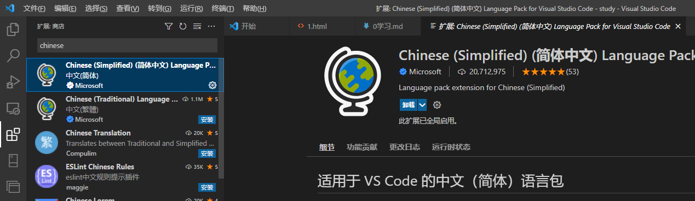
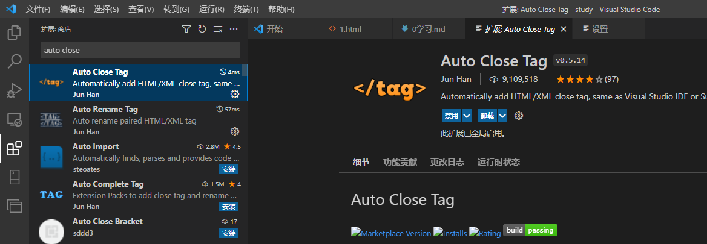
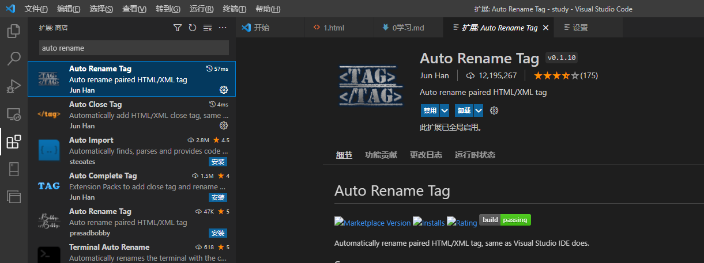
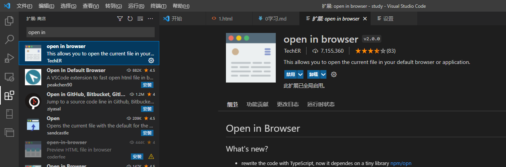
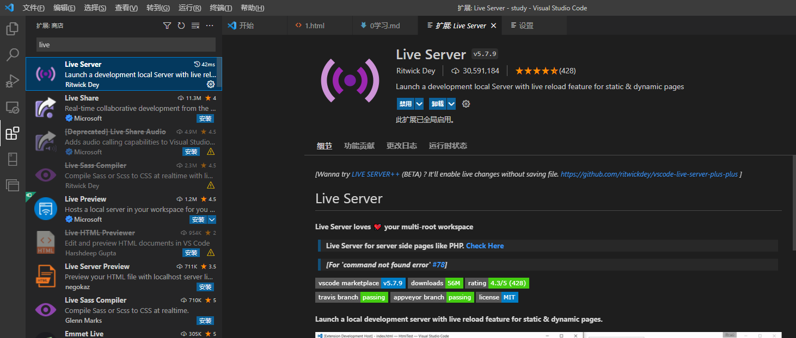

# day001第一天

## 学习方式

1. 上课，不懂的就记就问。如果当天晚上12点不懂，就代表有问题。
2. 练习，上课退微信，写好之后就重写一遍。
3. 作业。
4. 复习，当天晚上复习。周四复习周一到周三，以及之前。周日复习周五到周六，以及之前。以及精简之前内容。复习不可看视频。写md文档放到网上。

## 上课时间

周四、周日休息，其它时间上课  
上午9:30 到 13:00;下午15:00 到 18:00  
晚自习：19:00 到 20:30(强制性上晚自习，晚自习不讲课，主要是课程辅导，练习作业/面试题/随堂小练习)  

## 下载

### 下载浏览器

官网: <https://www.google.cn/intl/zh-CN/chrome/>
不用翻墙: <http://www.downcc.com/soft/1158.html>

chrome：可肉

### 下载VSCode

#### 软件本体

官网： <https://code.visualstudio.com/>

#### 下载VSCode插件

汉化插件-Chinese (Simplified) (简体中文) Language Pack for Visual Studio Code


chinese-拆溺死-中国的
simplified-鲜扑范死-简化的
language-亮可理死-语言
pack-怕可-打包
package-怕可取-打包

自动闭合标签-Auto Close Tag


auto-阿抖-自动的
close-可肉死-闭合，关
tag-泰可-标签

自动-Auto Rename Tag


auto-阿抖-自动的
rename-力念-重命名
tag-泰可-标签

打开浏览器-open in browser


open-欧本-打开
in-in-进入，在...之内
browser-不涝死

小型服务器-Live Server-和open in browser差不多,不过它可以实时更新对应的html


live-力伏-活着
server-奢我-服务器

### 设置谷歌浏览器为默认浏览器

### 基础HTML

#### 双标签与自闭合标签

1. HTML 标签是由尖括号包围的关键词。
2. 成对出现的，标签中的第一个标签是开始标签，第二个标签是结束标签也叫闭合标签，如div。
3. 只有一个的，则叫单标签，如br或img。

#### 注释标签

1. html注释就是html中对某一块内容的解释，但是不会被浏览器编译。
2. 注释的快捷键  ctrl+/  或者 ctrl+shift+/。

shift-雪伏-改变

#### HTML网络框架

快捷创建网页框架-可以默写，了解里面的各个含义

```html
<!-- 文档类型指令，快捷键 !+tab 或 !+enter -->
<!DOCTYPE html>
<!-- html页面主结构,lang表示语言属性 -->
<html lang="en">
  <head>
    <!-- charset表示语言集; UTF-8万国码，其它的如gbk之类的中文码没必要用，可能会有乱七八糟的错。 -->
    <meta charset="UTF-8" />
    <title>文档标签页上的文字</title>
  </head>
  <body>
  页面主体内容
  </body>
</html>
```

doctype-断泰啵-文档类型
lang-亮-语言
head-烟-头部
meta-蔑塔-元
title-泰抖-标题
body-波体-主体

#### 标签属性

标签属性-分为内置属性和自定义属性 --> 进阶为es5标准的自定义组件（Web Components）。

web-外扑-网络
components-可波妮死-组件

- 内置属性是自带的，里面可以设置各种功能。
- 自定义属性是自己写的，一般只用于记录一些数据。

结构说明

- lang=“en”  : 键值对。
- lang : 属性名/key/键。
- "en" : 属性值/value/值。

### 笔记

印象笔记-马克飞象： <https://maxiang.io/>  个人主要用这个

语雀： <https://www.yuque.com/dashboard> 可以试着用这个

Markdown: 用VSCode，教程用<https://www.runoob.com/markdown/md-table.html>

### 标签

### 标签关系

嵌套关系、父子关系

并列关系、兄弟关系

#### 常用标签

1. p段落标签，用于段落，段落有间隔，一般用于显示。样式其实也可以都只用div。
2. h1到h2标题标签，一般仅标题和logo用，一般也只用到h1到h3。
3. br换行标签，一般在div或p标签内部用于换行时用。
4. hr分割线标签，一般在div与p标签之间用。
5. img图片标签。
      - src，图片的地址。
      - alt，图片加载失败后显示的文本。
      - title，移动到图片上提示的图片标签文字。

      ```html
      
      ```

    alt-欧可-替换键
    title-泰抖-标题

6. a超链接标签

    - href="本地或线上文档地址#锚点标签id名"  : 就直接可以跳转到想要的地方。
    - target="链接打开的窗口" : 控制所点击链接打开的新窗口位置。
        - target="_self" : 默认，在当前窗口上打开链接。
        - target="_blank" : 默认，在新的空白窗口上打开新链接。

    ```html
        <a href="https://www.baidu.com">跳转到外部链接</a>
        <a href="./2我的第二个页面.html">跳转到内部链接</a>
        <a href="#">重新加载本页并回到顶部</a>
        <a href="javascript:;">占位不做操作javascript:;</a>
        <a href="./2我的第二个页面.html#锚点标签id名顶部">锚点标签id名顶部</a>
    ```

    href-鹤伏-地址
    target-他 get-目录
    self-哨伏-自身
    blank-烂可-空白的

7. div大盒子标签
    div-帝伏-分区
8. span小盒子标签
    span-死半-间距
9. 三大列表

    - ol与li有序
    - ul与li无序
    - dl与dt类名/dd项目自定义列表

10. 格式化标签

    - strong加粗标签
    - b加粗标签
    - em斜体标签
    - i斜体标签
    - del删除线
    - s删除线
    - ins下划线
    - u下划线

    strong-死壮-强壮的
    ins-in 死-插入键

11. pre预格式化标签

    pre-P伏-展示

12. iframe内联框架标签

    - frameborder="0"为无边框。frameborder="1"为有边框。
    - width="300" 宽，单位px。
    - height="300" 高，单位px。

    iframe-I伏琳-框架

## HTML实体字符与实体编号

|  含义   |   实体字符   |   实体编号  |
| ----- | ------ | ------ |
|    空格   |   &npsp;   |   实体编号  |

## 元素类型

1. 行内元素

    - 横向排列
    - 共占一行
    - 不能设置宽高

2. 行内块元素

    - 横向排列
    - 共占一行
    - 能设置宽高

3. 块元素

    - 纵向排列
    - 独占一行
    - 能设置宽高

## 补充

### 2023年前端常用的IDE（编辑工具）

Visual Studio Code: <https://code.visualstudio.com/（推荐使用>）

Webstorm: <http://www.jetbrains.com/webstorm/>

HBuilder : <http://www.dcloud.io/>

Sublime Text : <http://www.sublimetext.com/>

## 参考

1. [原生js也可以自定义组件](https://www.cnblogs.com/yuwenxiang/p/14345325.html)
