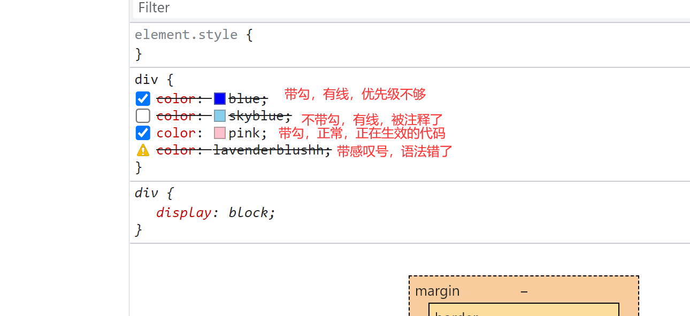

# day002学习

## css

### display更改显式类型

- `display:inline;` 行内元素。
- `display:inline-block;` 行内块级元素。
- `display:block;` 块级元素。
- `display:none;` 隐藏元素。

### css样式覆盖规则

- 层叠性: 同一样式区，从上向下执行，属性相同，后面的会覆盖前面的。
- 不同样式区，权重高的覆盖权重低的。

### 路径层级

访问另一个文件，实际上就是想尽一切办法跟目标文件处于同级。

#### 相对路径

实际上就是想尽一切办法从`当前文件所在目录`出发，前往另一个文件所在的目录。

- `不写` 或 `./` : 就是`当前文件所在目录`。
- `../` : 返回`当前文件所在目录`的父级目录。
- `目录名/` : `当前文件所在目录`里的下一层目录。

#### 绝对路径

包含本地绝对路径和网络绝对路径，都是从根路径出发，直接找到文件所在目录。

### 引入css

#### 静态引入

- 行内式，直接在标签上用style属性设置。

    ```html
    <div style="color: red;">行内式！</div>
    ```

- 内嵌式，通过style标签来写当前html文档的样式。

    ```html
    <style>
      div {
        color: red;
      }
    </style>
    ```

- 外链式，通过link标签把样式表给链接过来。

  ```html
  <link rel="stylesheet" href="css文件目录/css文件名1">
  <link rel="stylesheet" href="css文件目录/css文件名2">
  ```

- 导入式，在style标签通过@import把样式表给导入进来。

  ```html
    <style>
        @import "css文件目录/css文件名1";
        @import "css文件目录/css文件名2";
    </style>
  ```

#### 动态引入css样式

### 清除默认样式

浏览器都会有不同的默认样式，与预期不一致，所以要重置成预期的样式。

  比如body的margin默认为8px，但预期可能为0px，结果发现不管怎么做，页面中总有空隙。

这个一般由项目负责人统一引入一次，后期开发就不用引入了。

### 常用样式

#### color字体颜色

##### 颜色的写法

- `红r 绿g 蓝b`三原色，如 `rgb(0, 0, 255)` 。
  - 每一个颜色的值都是 0-255之间。
  - rgba带透明度，如 `rgba(0, 0, 255, 0.3)` 。
- 十六进制，如 `#0000ff`。
  - 十六进制带透明度，如 `#0000ff0f` 。
  - 简写，如 `#00f` 等于 `#0000ff` 。
- 直接写颜色单词，所有英文颜色单词都可以，如 `blue` 。
- `h色相s饱和度l亮度`，如 `hsl(0, 100%, 0%)` 。
  - hsla色相饱和度亮度带透明度，如 `hsla(360, 100%, 0%, 0.09)` 。

##### color的继承

 如果a标签拥有href属性，a标签链接的自带样色会盖过继承。

#### 控制台样式bug排查提示

- 带勾，有线，代表优先级不够。
- 不带勾，有删除线，表示被注释了。
- 带勾，正常显示，表示正在生效的css代码。
- 带感叹号，有删除线，表示语法错了。



#### font-family文本字体类名

- 可以写多个，用 <英文逗号,> 隔开，从左到右查询用户电脑上的字体。
  - 常见中文字体："Microsoft YaHei"、"SimHei"、"SimSun"、"宋体"。
- 中文字体，或者是英文字体由多个单词组成需要加单引号或者双引号。

##### 引入并使用外部字体，不依赖用户浏览器

#### font-size文本字体字号

- 常用的单位是px、em、rem。
- 谷歌浏览器默认字号大小是16px。
- 浏览器支持的最小字号多数是12px如果设置12以下，字体一般还是为12px。
- 如果设置字号为0 那么文字高度为0，消失！

#### font-weight文本字体粗细

用来定义字体的粗细。

- 用单词来表示
  - normal: 正常粗细。
  - bold: 加粗。
- 用100-900之间可以整除100的整数来表示
  - 100-300: 是细。
  - 400-500: 正常。
  - 600-900: 加粗。

#### font-style文本字体风格

一般字体都有两种格式: 正常风格，或者是倾斜风格。

- normal: 默认值，让元素呈现正常风格。
- italic: 让元素呈现斜体风格。

#### line-height行高

行框line box 与行盒line boxes的概念。

字体字号font-size + 行上间距 + 行下间距 = 行高line-height。

- 行高单位
  - 直接带单位如px，按单位来算。
  - 不带单位，等于当前文本大小font-size的多少倍，如 line-height:1.5; 。
  - 带百分比，等于当前文本大小font-size的百分之多少，如 line-height:150%; 。
- 行高让单行文本垂直居中。
  - 让line-height与height相等，并且都大于font-size。那么单行文本就会垂直居中了，但如果文本为多行，要设置overflow: hidden;。

#### text-align行内横向对齐

text-align规定行内的内容如何相对于它的块级父元素水平方向对齐。

- text-align仅能控制当前容器内的行内元素及行内块元素的水平排列方式。

#### text-indent首行缩进

设置一个文本块第一行的缩进。

- 单位
  - px，缩进指定像素。
  - em，1em相当于当前文本块的一个font-size单位。
- 对于块级元素及行内块元素生效，对行内元素不生效。

#### background-color背景颜色

设置当前元素的背景颜色。

#### text-decoration修饰线外观

设置当前元素内部元素的文本修饰线。

- none: 取消下划线。
- underline: 下划线。
- overline: 上划线。
- line-through: 删除线。

#### width宽度

- 块级元素默认是占满父级元素。
- 行内块元素是由内容撑开，但可以设置宽度。
- 行内元素是由内容撑开，不可以设置宽度。

#### height高度

- 高度默认都是由内容撑开。

#### margin元素外边距

margin 属性为给定元素设置所有上右下左四个方向的外边距属性。

#### border元素边框

border 是简写属性，设置所有的边框属性。

可以按顺序设置如下属性：

- border-width 设置边框宽度。
- border-style 设置边框风格。
- border-color 设置边框颜色。

### 让元素消失看不见

1. display:none;
2. font-size:0;

### 使用边框设置三角形

思路: 让当前元素的宽度为0。四边边框有一个边框宽度为0，其中一个边框指定三角形的高，相邻的两边边框的和代表三角形底边的长。对应三角形高的那个边框的颜色就是三角形的颜色，而其余的边框颜色则设置为透明。

```html
<style>
  div {
    width: 0;
    border:  100px solid skyblue;
    border-color: transparent transparent skyblue transparent;
  }
</style>
```

实际生效：

```html
<style>
  div {
    width: 0;
    border-width: 0 10px 100px 60px;
    border-style: solid;
    border-color: transparent transparent skyblue transparent;
  }
</style>
```

### 块级元素在父级元素中水平居中

让当前块级元素的宽度小于父级元素的宽度，之后设置`margin-top`与`margin-bottom`为0，`margin-left`与`margin-right`为`auto`。

```html
<style>
  div{
    width:100px;
    height:100px;
    margin:0 auto;
  }
</style>
```

## 进阶参考

1. [CSS引入外部字体](https://blog.csdn.net/weixin_42157552/article/details/80851160)
2. [DOM系列：动态添加CSS样式规则-动态引入css样式](https://www.imooc.com/article/50779)
3. [一种简单实用的 JS 动态加载方案](https://juejin.cn/post/6953193301289893901)
4. [CSS样式的五种来源及浏览器默认样式](https://blog.csdn.net/u013778905/article/details/52886938)
