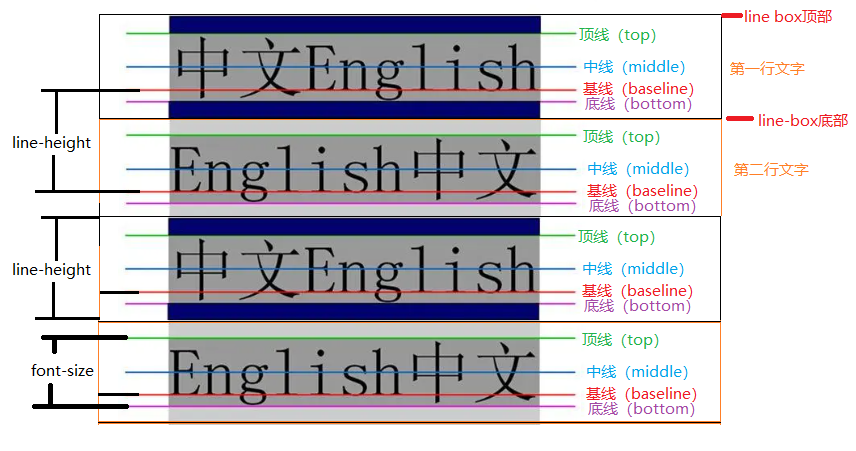
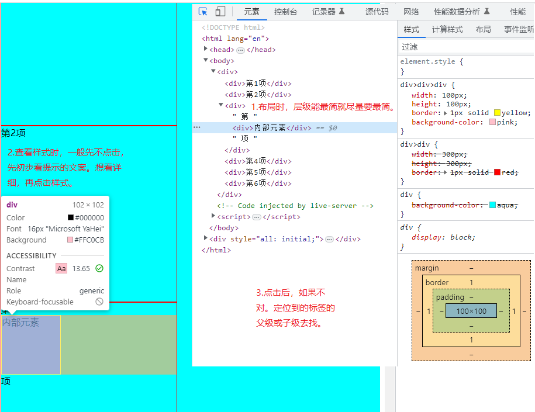
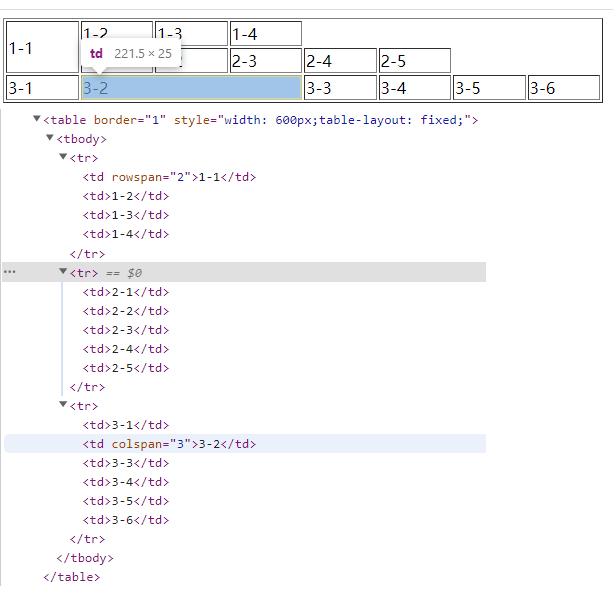

# day-004-four-20230210-line-height及vertical-align及table相关元素及表单相关元素

<!-- markdownlint-disable MD033 -->
<style>
  /*设置该md文档全局样式*/
  img {
    border-radius: 10px !important;
    border: 2px solid skyblue;
    max-height:300px;
    display: block;
    margin: 5px auto;
  }
</style>
<!-- markdownlint-enable MD033 -->

## 复习

### `ul>li`有序列表每一项设置边框

要在`ul>li`有序列表每一项设置边框

- 思路实际上就每个子元素都设置边框，之后用相邻兄弟选择器或通用兄弟选择器清掉重叠的边框线。
  - 这个思路也可以用在`ol>li`无序列表及`dl>dt/dd`自定义列表。

```html
<!DOCTYPE html>
<html lang="en">
<head>
  <meta charset="UTF-8">
  <title>页签标签</title>
  <style>
    li{
      border: 1px solid rgb(255,255,0);
    }
    li~li{
      border-top-width: 0;
    }
  </style>
</head>
<body>
  <ul>
    <li>第1项</li>
    <li>第2项</li>
    <li>第3项</li>
    <li>第4项</li>
  </ul>
</body>
</html>
```

### line-height行高

#### 定义

`line-height`就是当前元素内部内容每一行基线与基线之间的高度。

它的值会继承到子元素身上。

默认值约为1.2，不过不同浏览器不一样，一般是1.0到1.5之间。

#### 继承性

- 从父级继承到自身时，只会继承父级具体的数字或`px`像素。
  - 但是继承之后的计算，还是相对于自身`font-size`属性。

#### `line-height`和`height`和`font-size`的区别

- `height`指的是元素的整体高度
- `line-height`指的是一行文字所占据的高度
- `font-size`指的是一个文字的高度

## `vertical-align`

如果一个块元素没有设置具体的`height`，那么它是由内容撑起来的，即多行文本中每一行的行高加起来的。

`vertical-align` 用来指定`inline行内元素`或`table-cell表格单元格元素`的垂直对齐方式。

- `vertical-align` 只对行内元素、行内块元素和表格单元格元素生效，不能用它垂直对齐块级元素。

### `top-line顶线`与`middle-line中线`与`base-line基线`与`bottom-line底线`与`line-box行内盒子`与`line-boxes行盒`等概念



- `父级元素基线`一直都在。
  - 元素的`vertical-align`只是让元素自身的`top-line顶线`与`middle-line中线`与`base-line基线`与`bottom-line底线`等概念与`父级元素基线`进行各种对齐。
- 图片默认基线是底部
- 文本的`baseline基线`是`字母x`的下方
- `inline-block行内块元素`默认的`baseline基线`是`该行内块元素margin-bottom`的底部，没有`margin`就是盒子底部
- `inline-block行内块元素`内部有文字的时候，其`baseline基线`就是`其内部最后一行文本x`的下方

### `vertical-align`可选值

- `baseline` 把`元素自身基线`与`父级元素基线`对齐。
- `top` 把`元素及其后代元素的顶部`和`当前line-boxes行盒顶部`对齐。
- `middle` 把`元素自身中心点`与`当前line-boxes行盒基线加上x-height一半高度的线`对齐。
  - `middle`是行内级盒子的中心点与父盒子基线加上x-height一半的线对齐，x一半的位置不在中线上，因为大部分字体都是文本下沉的。
- `bottom` 把`元素及其后代元素的底部`跟`当前line-boxes行盒底部`对齐。

## CSS布局心得-层级最简与样式快速查找

- 布局时，层级能最简就尽量要最简。
- 查看样式时，一般先不点击，先初步看提示的文案。想看详细，再点击样式。
- 点击后，如果不对。定位到的标签的父级或子级去找。
<!-- markdownlint-disable MD033 -->

<!-- markdownlint-enable MD033 -->

## Emment语法

- 元素标签
  `div` → `<div></div>`
- 元素内写文本
  `div{文本}` → `<div>文本</div>`

## 表格元素

### table的基础元素

- `<table></table>`元素，`唯一必选[1,1]`，表格主体。
  - `<caption></caption>`元素，`可选但最多一个[0,1]`，表格标题，但实测写多个也是可以的
  - `<colgroup></colgroup>`元素，`零个到多个[0,]`，配合col元素用来定义表中的一组列表的样式。
    - `<col/>`元素，`零个到多个[0,]`，用于控制底下对应列的样式。
  - `<thead></thead>`元素，`可选但最多一个[0,1]`，表格的列头行，但实测写多个也是可以的。
    - `<tr></tr>`元素，`零个到多个[0,]`，表示一行。
      - `<th></th>`元素，`零个到多个[0,]`，加粗并居中。
      - `<td></td>`元素，`零个到多个[0,]`，普通单元格。
  - `<tbody></tbody>`元素，`零个到多个[0,]`，表格的主体行。
    - `<tr></tr>`元素，`零个到多个[0,]`，表示一行。
      - `<th></th>`元素，`零个到多个[0,]`，加粗并居中。
      - `<td></td>`元素，`零个到多个[0,]`，普通单元格。
  - `<tfoot></tfoot>`元素，`可选但最多一个[0,1]`，表格的汇总行，但实测写多个也是可以的。
    - `<tr></tr>`元素，`零个到多个[0,]`，表示一行。
      - `<th></th>`元素，`零个到多个[0,]`，加粗并居中，标题单元格。
      - `<td></td>`元素，`零个到多个[0,]`，普通单元格。
  - `<tr></tr>`元素，`零个到多个[0,]`，表示一行。
    - `<th></th>`元素，`零个到多个[0,]`，加粗并居中。
    - `<td></td>`元素，`零个到多个[0,]`，普通单元格。

从标签语义化来说，最好是使用`<thead></thead>`等元素，方便浏览器的搜索引擎以及一些扩展。

不过从快速开发及最简层级的角度出发，只使用`<tr></tr>`元素也是可以，样式的设置要来得方便。

### 表格样式

#### `<table></table>`元素的属性

`<table></table>`元素的属性，不建议使用。尽量用css样式来达到同样效果。

- `border` : 已废弃但还能用，使用像素，定义了表格边框的大小如果设置为1，表示表格具有1px大小的边框。

  ```html
  <table border="1"></table>
  ```

  等价于

  ```html
  <table></table>
  <style>
    table {
      border: 1px solid #000;
    }
    th,
    td {
      border: 1px solid #000;
    }
  </style>
  ```

- `cellpadding` : 已废弃但还能用，这个属性定义了表格单元的内容和边框之间的空间。如果它是一个像素长度单位，这个像素将被应用到所有的四个侧边

  ```html
  <table cellpadding="22"></table>
  ```

  等价于

  ```html
  <table></table>
  <style>
    th,
    td {
      padding: 22px;
    }
  </style>
  ```

- `cellspacing` : 已废弃但还能用，使用百分比或像素从水平和垂直方向上定义了两个单元格之间空间的大小。

  ```html
  <table cellspacing="20"></table>
  ```

  等价于

  ```html
  <table></table>
  <style>
    table {
      border-spacing: 20px;
    }
  </style>
  ```

- `width` : 已废弃但还能用，定义了表格的宽度。宽度可能是一个像素或者是一个百分比值，宽度的百分比值将被定义为表格容器的宽度。

  ```html
  <table width="20"></table>
  ```

  等价于

  ```html
  <table></table>
  <style>
    table {
      width: 20px;
    }
  </style>
  ```

#### `<table></table>`元素的style样式

- `border-collapse: collapse;` 合并边框线

  ```html
  <table></table>
  <style>
    table {
      border-collapse: collapse;
    }
  </style>
  ```

- `table-layout:fixed` 宽度平均分布
  - 前提: `table`要设置具体的宽度

    ```html
    <table></table>
    <style>
      table {
        width: 700px;
        table-layout: fixed;
      }
    </style>
    ```

### `<td></td>普通单元格`与`<th></th>标题单元格`的表格合并

- `colspan`:设置向右跨列，`那个单元格`需要`向右占据多少个单元格`就给谁设置。
- `rowspan`：设置向下跨行,`那个单元格`需要`向下占据多少个单元格`就给谁设置。
  - 如果下方是一个单元格的初始开头，那么下方单元格就会向后移动。
  - 如果下方不是一个单元格的初始开头，那么下方单元格就不会向后移动，并且该单元格位于下方单元格图层的下方。

#### 单元格合并例子

- 例子一:

    ```html
    <table border="1" style="width: 600px;table-layout: fixed;">
      <tr>
        <td rowspan="2">1-1</td>
        <td>1-2</td>
        <td>1-3</td>
        <td>1-4</td>
      </tr>
      <tr>
        <td>2-1</td>
        <td>2-2</td>
        <td>2-3</td>
        <td>2-4</td>
        <td>2-5</td>
      </tr>
      <tr>
        <td>3-1</td>
        <td colspan="3">3-2</td>
        <td>3-3</td>
        <td>3-4</td>
        <td>3-5</td>
        <td>3-6</td>
      </tr>
    </table>
    ```

    
    可以看到基础的合并规则。

- 例子二:

  ```html
  <table border="1" style="width: 600px;table-layout: fixed;">
    <tr>
      <td>1-1</td>
      <td rowspan="3" style="background-color: skyblue;color: red;">1-2向下跨行，总三行。如果下方是一个单元格的初始开头，那么下方单元格就会向后移动。如果下方不是一个单元格的初始开头，那么下方单元格就不会向后移动，并且该单元格位于下方单元格图层的下方。</td>
      <td>1-3</td>
      <td>1-4</td>
    </tr>
    <tr>
      <td colspan="4" style="background-color: pink;color: yellow;">2-12-1向右跨列，总四列，这个会优先显示。</td>
      <td>2-2</td>
      <td>2-3</td>
      <td>2-4</td>
      <td>2-5</td>
    </tr>
    <tr>
      <td>3-1</td>
      <td>3-2</td>
      <td>3-3</td>
      <td>3-4</td>
      <td>3-5</td>
      <td>3-6</td>
    </tr>
  </table>
  ```

  可以看到如果横向与纵向冲突的情况。

## 表单元素

表单在网页中就是将本地数据提交给远程的服务器。

目前则主要是用表单元素来收集用户的输入，之后处理这些数据如校验之类的，再用`AJAX`传给后端。

### 表单基础元素

#### `<form></form>`标签

- 为用户创建`html表单`，并且可以向服务器发送数据。
  - `action` : 表单提交的地址。

    ```html
      <form action="1.html"></form>
    ```

#### `<input/>`元素

- `type="text"` : 普通文本输入框text

  ```html
  <input type="text" value="普通文本输入框text"/>
  ```

- `type="password"` : 密码输入框password

  ```html
  <input type="password" value="密码输入框password">
  ```

- `type="radio"` : 单选框radio

  ```html
  <input type="radio" value="单选框radio">
  ```

- `type="checkbox"` : 多选框checkbox

  ```html
  <input type="checkbox" value="多选框checkbox">
  ```

- `type="button"` : 普通按钮button

  ```html
  <input type="button" value="普通按钮button">
  ```

- `type="reset"` : 重置按钮reset

  ```html
  <input type="reset" value="重置按钮reset">
  ```

- `type="submit"` : 提交按钮submit

  ```html
  <input type="submit" value="提交按钮submit">
  ```

#### `<input/>`元素常见属性

- `type`: 决定`<input/>`元素的类型。
- `name`: 要提交数据时的name名
- `value`: input标签的内容及值
- `autofocus`: 自动获取光标，一般用来提示用户从那开始输入
- `autocomplete`: `on`/`off` 自动补全数据
  - 可以设置在`form`上，设置表单内所有标签的自动补全设置。
  - 但要设置`name`属性后才能使用。
- `checked`: 默认选中，适用于input标签元素的默认选中
- `readonly`: 只读
  - 提交时依旧会提交对应的`name`数据
- `disabled`: 禁用
  - 提交时不会提交对应的`name`
- `required`: 校验必填项是否非空
- `placeholder`: 提示文字

#### `<button></button>`元素

`<button></button>`元素被点击后依旧会自动提交当前所在表单，和`<input type="submit"/>`差不多。

#### 备注

`readonly`与`disabled`的区别

- `disabled`不会提交
  - 应用场景，后台返回的数据要放在页面上与可修改属性放在一起时。

绑定单选框

- 在单选框元素上设置`name属性`，`name属性值`相同时，都为同一组。
- 在单选框元素上设置`value属性`，选中后该单选框的值就是该`value属性值`。

绑定多选框

- 在多选框元素上设置`name属性`，`name属性值`相同时，都为同一组。
- 在多选框元素上设置`value属性`，选中后该单选框的值就是`value属性值`。

#### `<label></label>`标签

- 使用方法：用`<label></label>`标签把文字包括起来，让里面的`for属性值`和表单上面`id属性值`一致即可。
  - 之后点击该`<label></label>`标签，就相当于点击中了对应`id属性值`的表单元素。
- 绑定的表单元素也可以包含在该`<label></label>`标签内部。

### 其它标签

#### `<select></select>`与`<option></option>`下拉框

`<select></select>`元素属性

- `name` 设置要提交数据时的name名

`<option></option>`元素

- `<option></option>`元素代表下拉框列表的每一项显示出来的值
- `<select></select>`元素最终提交的内容是通过`<option></option>`元素的`value`属性
  - 如果`<option></option>`元素的`value`属性不设置，那么它会直接用`<option></option>`元素里的文本值
- `selected`属性 设置下拉框的默认选中

#### `<textarea></textarea>`多行文本框

`<textarea></textarea>`元素是多行文本输入框，右下角可以放大缩小。

- `resize: none;` 禁止重置尺寸，让右下角不能放大及缩小。
- `outline: none;` 清掉文本框的外框线。
- `cols="100"` 设置一行应该有多少个文字，即文本框有多少列。
- `rows="10"` 设置文本框有多少行。

## 参考

1. [emment插件语法](https://www.cnblogs.com/yunqianduan/p/3975070.html)
2. [Emment常用语法](https://www.cnblogs.com/kaiwandao/p/15964071.html)
3. [深入理解CSS中的line-height](https://juejin.cn/post/6844903910382010382)
4. [CSS中的行盒（line-boxes）和行内盒子（line-box）](https://blog.csdn.net/qq_15601471/article/details/119903856) 推荐一定要看
