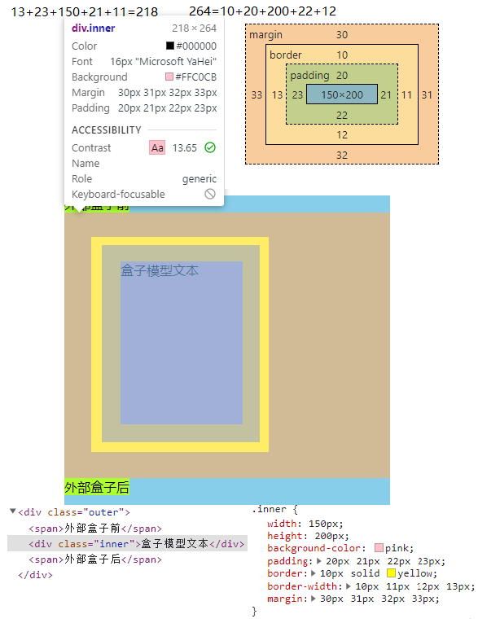
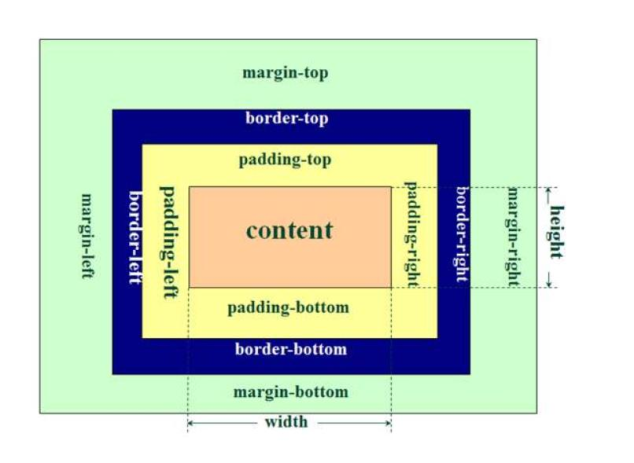

# day-005-five-20230211-css盒子模型及`border-radius`及`text-align-last`及`::placeholder伪类`

<style>
  /*设置该md文档全局样式*/
  img {
    border-radius: 10px !important;
    border: 2px solid skyblue;
    max-height:300px;
    display: block;
    margin: 5px auto;
  }
</style>

## 浏览器bug查找

在那个元素上直接使用右键用检查打开源码，会直接定位到那个元素上。

元素上标注出来的宽高是 `内容区宽高`+`padding四周`+`border四周`。


## `vsCode分屏`

- 左侧文件区长按文件并拖到右侧编辑区，在编辑区的上右下左侧放下，屏幕就会自然向上向右向下向左分屏。
- 鼠标在文件标签名上右键，点击向上拆分，向右拆分，向下拆分，向左拆分，屏幕就会自然向上向右向下向左分屏。

## css盒子模型

### 盒子模型

<!-- markdownlint-disable MD033 -->
<!--  -->

<!-- markdownlint-enable MD033 -->

```html
<!DOCTYPE html>
<html lang="en">
<head>
  <meta charset="UTF-8">
  <title>css盒子模型</title>
  <style>
    .outer{
      width: 400px;
      height: 400px;
      background-color: skyblue;
    }
    span{
      background-color: greenyellow;
    }

    .inner{
      width: 150px;
      height: 200px;
      background-color: pink;

      padding: 20px 21px 22px 23px;

      border: 10px solid yellow;
      border-width: 10px 11px 12px 13px;

      margin: 30px 31px 32px 33px;
    }

    /* .inner{
      box-sizing: border-box;
    } */
  </style>
</head>
<body>
  <div class="outer">
    <span>外部盒子前</span>
    <div class="inner">盒子模型文本</div>
    <span>外部盒子后</span>
  </div>
</body>
</html>
```

#### css标准盒子模型

- `content` 内容区
  -`width` 宽度
  - `height` 高度
- `padding` 内填充 内容到边框的距离
- `border` 边框
- `margin` 外边距

#### IE怪异盒子模型


`width属性`=`content内容区宽度`+`左右padding`+`左右border`。

- `width` 宽度
  - `content` 内容区
  - `padding` 内填充
  - `border` 边框
- `height` 高度
  - `content` 内容区
  - `padding` 内填充
  - `border` 边框
- `margin` 外边距

##### 应用场景

- 控制台查看宽度及高度是多少，直接就可以设置宽高。
  - 也就是已知某个区域的宽高后续不再改变，但`元素内部内容区`或`padding`或`border`或`margin`之类的后期要频繁修改时。
- 快速写静态页面时，直接看一个区块的大小，不考虑内部border及padding之类的宽度。
  - 比如能看到怪异盒子模型的宽度，即`content内容区宽度`+`左右padding`+`左右border`的总和，但一些设置了border之类的，内容区就会有多一个px之类的显示问题。
- 设置`input输入框`的宽度及高度。

### 设置盒子模型box-sizing

- `box-sizing: content-box;` css标准模型;
- `box-sizing: border-box;` IE怪异模型;

### 使用

- 涉及到方位一般是按顺时针方向来的: 上右下左。
- 元素自身和并列元素(兄弟)之间的间距一般用`margin`。
- 只涉及到元素自身与元素内部内容的间距一般用`padding`。

- 通过查看网页来复制样式，如宽度及高度固定的，一般用IE盒子模型来达成样式。
  - 不过如果有时间，最好还是用标准盒子模型。
  - `input标签`之类可以用IE盒子模型。比如设置一个总体宽高固定，但`padding`及`border`的设置要细调导致事先不能确定的输入框。
- 如果是设计师给的图的话，一般就用标准盒子模型。

### `margin合并`

两个并列的块元素: `上方块元素A`的`margin-bottom`与`下方块元素B`的`margin-top`会合并，并且合并后的两个元素的按照`其中最大的margin值`来取。

  ```html
  <style>
    .box1 {
      width: 200px;
      height: 200px;
      background-color: aquamarine;

      margin-bottom: 40px;
    }
    .box2 {
      width: 300px;
      height: 300px;
      background-color: greenyellow;

      margin-top: 60px;
    }
  </style>
  <div>
    <div class="box1">`box1的margin-bottom`为40px与</div>
    <div class="box2">`box2的margin-top`为60px，两者之间的间距里只剩下最大的`box2的margin-top`,即为60px</div>
  </div>
  ```

发现`box1`与`box2`之间的`margin`总共只有`60px`，而不是`40px+60px=100px`。

#### 解决方式

解决`margin合并`是给某个子元素添加父元素，然后给这个新增的父元素触发`bfc`。

- 相当于修改了`HTML骨架结构`。

不推荐使用，最好还是计算好想要间距，并把这个间距设置给其中一个元素的`margin-bottom`或`margin-top`。

- 因为这个`margin合并`是为了让文档看得更舒服点，让两个元素间的间距不会太高，可以认为是浏览器厂商专门设置的。

### `margin穿透`

父元素与子元素: 在子元素设置`margin-top`的高度，发现并不是在子元素内部生效，而是在父元素上生效。

- 相当于
- 父子嵌套的元素`垂直方向的margin取最大值`并赋值给父元素。

  ```html
  <style>
    .outer {
      width: 400px;
      height: 400px;
      background-color: pink;
    }
    .inner {
      width: 200px;
      height: 200px;
      background-color: yellow;
      margin-top: 10px;
    }
  </style>
  <div class="outer">
    <div class="inner">
      在子元素设置上`margin`的高度，发现并不是在子元素内部生效，而是在父元素上生效。
    </div>
  </div>
  ```

发现效果并不是子元素在父元素内部撑开`margin-top`，而是在父元素上的`margin-top`。

解决方式: 在父元素上设置`overflow: hidden;`。

  ```html
  <style>
    .outer {
      width: 400px;
      height: 400px;
      background-color: pink;
      overflow: hidden;
    }
    .inner {
      width: 200px;
      height: 200px;
      background-color: yellow;
      margin-top: 10px;
    }
  </style>
  <div class="outer">
    <div class="inner">
      内部设置上下margin的高度，发现并不是在子元素内部生效，而是在父元素上生效。
    </div>
  </div>
  ```

## `border-radius`圆角边框

`border-radius`设置四周的圆角边框。

- 写法
  - `border-radius:5px;` 上右下左分别`5px`。
  - `border-radius:5px 10px;` 上下各`5px`，左右`10px`。
  - `border-radius:5px 10px 15px;` 上`5px`，左右各`10px`，下`15px`。
  - `border-radius:5px 10px 15px 20px;` 上`5px`，右`10px`，下`15px`，左`20px`。

### 用`div标签`画一个圆

- 用一个正方形的有长度的`div`，外加`border-radius:50%;`。

```html
<style>
  .outer {
    width: 400px;
    height: 400px;
    border-radius: 50%;
  }
</style>
<div class="outer">
</div>
```

### `outline`与`border`都是设置元素的边框，有何区别？

- `outline`简写属性在一个声明中设置所有的轮廓属性,设置的属性按顺序分别是：`outline-color`, `outline-style`, `outline-width`。
- 轮廓`outline`是绘制于元素周围的一条线，位于边框边缘`border`的外围，可起到突出元素的作用。
- 轮廓`outline`属性的位置让它不像边框那样参与到文档流中，因此轮廓出现或消失时不会影响文档流，即不会导致文档的重新显示。

```html
<style>
  .outer {
    width: 700px;
    height: 700px;
    margin: 70px auto;
    border: 100px solid yellow;

    background-color: blue;
  }
  .inner {
    width: 400px;
    height: 400px;

    background-clip: content-box;
    background-color: gray;
    background-size: 300px 300px;
    background-image: repeating-linear-gradient(
      black 0,
      black 30px,
      green 30px,
      green 60px
    );
    background-repeat: no-repeat;

    padding: 30px;

    border: 10px double red;

    outline: 50px dotted skyblue;

    margin: 20px;
  }
</style>
<div class="outer">
  <div class="inner"></div>
</div>
```

## 前端博客类网址

1. [稀土掘金](https://juejin.cn/)
2. [博客园](https://www.cnblogs.com/)
3. [CSDN](https://blog.csdn.net/seetoyou/article/details/128978956)
4. [简书](https://www.jianshu.com/)

## `text-align-last`最后一行文本对齐规则

`text-align-last`对一段文本中最后一行在被强制换行之前的对齐规则。

`text-align`虽然比较早，但`text-align-last`支持的功能更少。

- 并且有些属性值`text-align`只能支持多行的，而对于只有一行或者首行或尾行的支持不够好。

`text-align-last: justify;` 最后一行文字的开头与内容盒子的左侧对齐，末尾与右侧对齐。

- `text-align-last: justify;`与`text-align: justify-all;`差不多，但`text-align: justify-all;`有些浏览器不支持。

## `::placeholder伪类`设置`placeholder提示文案`的样式

`::placeholder` 可以选择一个表单元素的占位文本，它允许开发者和设计师自定义占位文本的样式。

用到`placeholder属性`的标签是`input标签`，`placeholder属性`主要作用是让输入框有个提示用户的占位文本。

```html
<input type="text" placeholder="提示文案">
```

1. `::placeholder`伪类
    - 支持性较好

    ```html
    <style>
      input::placeholder{
        color:#DD5A5D;
      }       
    </style>
    <input type="text" placeholder="提示文案">
    ```

2. `::-webkit-input-placeholder`实验性伪类
    - 可能已经没有用了，和`::placeholder`伪类重复了，或者就是`::placeholder`伪类的前置版本。

    ```html
    <style>
      input::-webkit-input-placeholder{   /* 使用webkit内核的浏览器 */
        color: #E0484B;
      }
      input:-moz-placeholder{    /* Firefox版本4-18 */
        color: #E0484B;
      }
      input::-moz-placeholder{    /* Firefox版本19+ */
        color: #E0484B;
      }              
      input:-ms-input-placeholder{   /* IE浏览器 */
        color: #E0484B;
      }        
    </style>

    <input type="text" placeholder="提示文案">
    ```

## 进阶参考

1. [::placeholder](https://developer.mozilla.org/zh-CN/docs/Web/CSS/::placeholder)
2. [设置placeholder属性样式的多种写法](https://blog.csdn.net/weixin_44484756/article/details/87648773)
3. [markdownlint规则详细介绍及自定义参数设置](https://www.jianshu.com/p/51523a1c6fe1)
4. [VSCode markdownlint插件自定义生效规则](https://suifengczc.github.io/2020/03/15/Tools/markdown/lint/)
5. [Markdown 图片](https://m.imooc.com/wiki/markdownlesson-markdownimage)
6. [Markdown 注释](https://m.imooc.com/wiki/markdownlesson-markdowncomment)
7. [Markdown通用规范-CommonMark Spec](https://spec.commonmark.org/)
8. [outline与border都是设置元素的边框，有何区别？](https://blog.csdn.net/qq_40614057/article/details/106022164)
9. [outline-MDN文档](https://developer.mozilla.org/zh-CN/docs/Web/CSS/outline)
10. [github README.md插入图片,图片尺寸设置,图片无法显示解决](https://www.cnblogs.com/cuijinlin/p/13817016.html)
11. [CSS轮廓（outline）属性详解及 outline 与 border 的区别](https://blog.csdn.net/TalonZhang/article/details/84261950)
