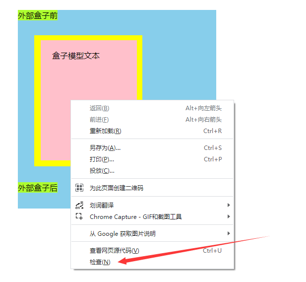
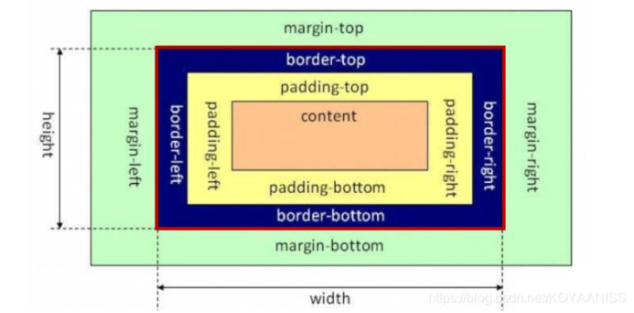

# day-005-five学习

<style>
  /*设置该md文档全局样式*/
  img {
    border-radius: 10px !important;
    border: 2px solid skyblue;
    max-height:300px;
    display: block;
    margin: 5px auto;
  }
</style>

## 浏览器bug查找

在那个元素上直接使用右键用检查打开源码，会直接定位到那个元素上。

元素上标注出来的宽高是 内容区宽高+padding四周+border四周。


## vsCode分屏

- 左侧文件区长按文件并拖到右侧编辑区，在编辑区的上右下左侧放下，屏幕就会自然向上向右向下向左分屏。
- 鼠标在文件标签名上右键，点击向上拆分，向右拆分，向下拆分，向左拆分，屏幕就会自然向上向右向下向左分屏。

## css盒子模型

### 盒子模型

<!-- markdownlint-disable MD033 -->
<!--  -->

<!-- markdownlint-enable MD033 -->

```html
<!DOCTYPE html>
<html lang="en">
<head>
  <meta charset="UTF-8">
  <title>css盒子模型</title>
  <style>
    .outer{
      width: 400px;
      height: 400px;
      background-color: skyblue;
    }
    span{
      background-color: greenyellow;
    }

    .inner{
      width: 150px;
      height: 200px;
      background-color: pink;

      padding: 20px 21px 22px 23px;

      border: 10px solid yellow;
      border-width: 10px 11px 12px 13px;

      margin: 30px 31px 32px 33px;
    }

    /* .inner{
      box-sizing: border-box;
    } */
  </style>
</head>
<body>
  <div class="outer">
    <span>外部盒子前</span>
    <div class="inner">盒子模型文本</div>
    <span>外部盒子后</span>
  </div>
</body>
</html>
```

#### css标准盒子模型

- content 内容区
  - width 宽度
  - height 高度
- padding 内填充 内容到边框的距离
- border 边框
- margin 外边距

#### IE怪异盒子模型


width=content+padding+border。

- width 宽度
  - content 内容区
  - padding 内填充
  - border 边框
- height 高度
  - content 内容区
  - padding 内填充
  - border 边框
- margin 外边距

##### 应用场景

- 控制台查看宽度及高度是多少，直接就可以设置宽高。
  - 也就是已知某个区域的宽高后续不再改变，但元素内部的内容或padding或margin之类的后期要频繁修改时。
- 设置input输入框的宽度及高度。

### 设置盒子模型box-sizing

`box-sizing: content-box;` css标准模型;
`box-sizing: border-box;` IE怪异模型;

### 使用

- 涉及到方位一般是按顺时针方向来的: 上右下左。
- 元素自身和并列元素(兄弟)之间的间距一般用margin。
- 只涉及到元素自身与元素内部内容的间距一般用padding。

- 通过查看网页来复制样式，如宽度及高度固定的，一般用IE盒子模型来达成样式。
  - 不过如果有时间，最好还是用标准盒子模型。
  - input标签之类可以用IE盒子模型。比如设置一个总体宽高固定，但padding及border的设置要细调导致事先不能确定的输入框。
- 如果是设计师给的图的话，一般就用标准盒子模型。

### margin合并

两个并列的块元素: 上方块元素A的margin-bottom与下方块元素B的margin-top会合并，并且合并后的两个元素的按照最大的margin值来取。

  ```html
  <style>
    .box1 {
      width: 200px;
      height: 200px;
      background-color: aquamarine;

      margin-bottom: 40px;
    }
    .box2 {
      width: 300px;
      height: 300px;
      background-color: greenyellow;

      margin-top: 60px;
    }
  </style>
  <div>
    <div class="box1">box1与box2的margin只剩下最大的那个</div>
    <div class="box2"></div>
  </div>
  ```

发现box1与box2之间的margin总共只有60px，而不是40px+60px=100px。

### margin穿透

父元素与子元素: 在子元素设置上下margin的高度，发现并不是在子元素内部生效，而是在父元素上生效。

  ```html
  <style>
    .outer {
      width: 400px;
      height: 400px;
      background-color: pink;
    }
    .inner {
      width: 200px;
      height: 200px;
      background-color: yellow;
      margin-top: 10px;
    }
  </style>
  <div class="outer">
    <div class="inner">
      在子元素设置上margin的高度，发现并不是在子元素内部生效，而是在父元素上生效。
    </div>
  </div>
  ```

发现效果并不是子元素在父元素内部撑开margin-top，而是在父元素上的margin-top。

解决方式: 在父元素上设置`overflow: hidden;`。

  ```html
  <style>
    .outer {
      width: 400px;
      height: 400px;
      background-color: pink;
      overflow: hidden;
    }
    .inner {
      width: 200px;
      height: 200px;
      background-color: yellow;
      margin-top: 10px;
    }
  </style>
  <div class="outer">
    <div class="inner">
      内部设置上下margin的高度，发现并不是在子元素内部生效，而是在父元素上生效。
    </div>
  </div>
  ```

### border-radius圆角边框

border-radius设置四周的圆角边框。

- 写法
  - `border-radius:5px;` 上右下左分别5px。
  - `border-radius:5px 10px;` 上下各5px，左右10px。
  - `border-radius:5px 10px 15px;` 上5px，左右各10px，下15px。
  - `border-radius:5px 10px 15px 20px;` 上5px，右10px，下15px，左20px。

#### 用div画一个圆

- 用一个正方形的有长度的div，外加`border-radius:50%;`。

```html
<style>
  .outer {
    width: 400px;
    height: 400px;
    border-radius: 50%;
  }
</style>
<div class="outer">
</div>
```

### outline与border都是设置元素的边框，有何区别？

- outline简写属性在一个声明中设置所有的轮廓属性,设置的属性分别是（按顺序）：outline-color, outline-style, outline-width。
- 轮廓（outline）是绘制于元素周围的一条线，位于边框边缘（border）的外围，可起到突出元素的作用。
- 轮廓（outline）属性的位置让它不像边框那样参与到文档流中，因此轮廓出现或消失时不会影响文档流，即不会导致文档的重新显示。

## 前端博客类网址

1. [稀土掘金](https://juejin.cn/)
2. [博客园](https://www.cnblogs.com/)
3. [CSDN](https://blog.csdn.net/seetoyou/article/details/128978956)
4. [简书](https://www.jianshu.com/)

## text-align-last最后一行文本对齐规则

text-align-last对一段文本中最后一行在被强制换行之前的对齐规则。

text-align虽然比较早，但text-align-last支持的功能更少。

- 并且有些属性值text-align只能支持多行的，而对于只有一行或者首行或尾行的支持不够好。

`text-align-last: justify;` 最后一行文字的开头与内容盒子的左侧对齐，末尾与右侧对齐。

- `text-align-last: justify;`与`text-align: justify-all;`差不多，但`text-align: justify-all;`有些浏览器不支持。

## ::placeholder伪类设置placeholder提示文案的样式

::placeholder 可以选择一个表单元素的占位文本，它允许开发者和设计师自定义占位文本的样式。

用到placeholder属性是在input标签里面，placeholder属性主要作用是让输入框有个提示的显示文案。

```html
<input type="text" placeholder="提示文案">
```

1. `::placeholder`伪类
    - 支持性较好

    ```html
    <style>
      input::placeholder{
        color:#DD5A5D;
      }       
    </style>

    <input type="text" placeholder="提示文案">
    ```

2. ::-webkit-input-placeholder实验性伪类
    - 可能已经没有用了，和`::placeholder`伪类重复了，或者就是`::placeholder`伪类的前置版本。

    ```html
    <style>
      input::-webkit-input-placeholder{   /* 使用webkit内核的浏览器 */
        color: #E0484B;
      }
      input:-moz-placeholder{    /* Firefox版本4-18 */
        color: #E0484B;
      }              
      input::-moz-placeholder{    /* Firefox版本19+ */
        color: #E0484B;
      }              
      input:-ms-input-placeholder{   /* IE浏览器 */
        color: #E0484B;
      }        
    </style>

    <input type="text" placeholder="提示文案">
    ```

## 进阶参考

1. [::placeholder](https://developer.mozilla.org/zh-CN/docs/Web/CSS/::placeholder)
2. [设置placeholder属性样式的多种写法](https://blog.csdn.net/weixin_44484756/article/details/87648773)
3. [markdownlint规则详细介绍及自定义参数设置](https://www.jianshu.com/p/51523a1c6fe1)
4. [VSCode markdownlint插件自定义生效规则](https://suifengczc.github.io/2020/03/15/Tools/markdown/lint/)
5. [Markdown 图片](https://m.imooc.com/wiki/markdownlesson-markdownimage)
6. [Markdown 注释](https://m.imooc.com/wiki/markdownlesson-markdowncomment)
7. [Markdown通用规范-CommonMark Spec](https://spec.commonmark.org/)
8. [outline与border都是设置元素的边框，有何区别？](https://blog.csdn.net/qq_40614057/article/details/106022164)
9. [outline-MDN文档](https://developer.mozilla.org/zh-CN/docs/Web/CSS/outline)
10. [github README.md插入图片,图片尺寸设置,图片无法显示解决](https://www.cnblogs.com/cuijinlin/p/13817016.html)
11. [CSS轮廓（outline）属性详解及 outline 与 border 的区别](https://blog.csdn.net/TalonZhang/article/details/84261950)
