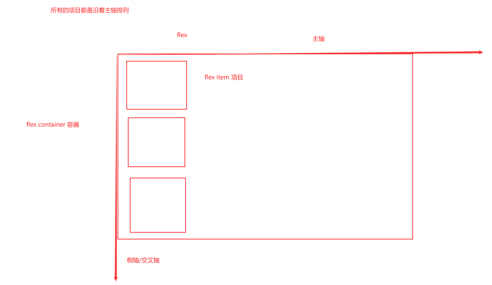

# day-008-eight-20230215-box-shadow与flex弹性盒布局的容器属性

## box-shadow

box-shadow用于在元素的框架上添加阴影效果。你可以在同一个元素上设置多个阴影效果，并用逗号将他们分隔开。

- 第一个值：阴影水平x偏移量
- 第二个值：阴影垂直y偏移量
- 第三个值：阴影阴影模糊半径(模糊的距离)
  - 值越大，模糊面积越大，阴影就越大越淡。不能为负值。
    - 默认为 0，此时阴影边缘锐利。
  - 对于长而直的阴影边缘，它会创建一个过渡颜色用于模糊 以阴影边缘为中心、模糊半径为半径的局域，过渡颜色的范围在完整的阴影颜色到它最外面的终点的透明之间。
- 第四个值：阴影的大小
  - 取正值时，阴影扩大；取负值时，阴影收缩。
    - 默认为 0，此时阴影与元素同样大。
- 第五个值：颜色
- 第六个值：阴影扩散方向 默认是`outset`，可选`inset`内阴影
  - 虽然`outset`是默认值，但如果填入这个，会报错的。

## flex弹性盒布局

flex是`Flexible Box`的缩写，意为`弹性布局`，用来为盒状模型提供最大的灵活性。

任何一个盒子都可以指定为Flex布局。

使用display来设置一个元素的布局为弹性布局。

display有两个与flex有关的值:

- flex: 块级弹性盒
- inline-flex: 行内弹性盒

- 一个元素设为`flex布局`以后，它的子元素的float和`vertical-align`属性将失效。

### flex

- flex容器 父元素，即设置了`display:flex;`或`display:inline-flex;`的元素。
- flex项目 flex容器的所有子元素自动成为容器成员，称为`flex 项目``flex item`
  - 是子代，不是后代

- 主轴 默认水平排列
- 侧轴 默认垂直排列

### 布局历史

- margin与padding与display
- float布局
- position布局
- flex布局
- grid布局

### 容器的属性

- flex-direction 决定主轴方向，也就是项目排列的方向
  - row 默认，主轴为水平方向，起点在左端。
  - row-reverse 主轴为水平方向，起点在右端。
  - column 主轴为垂直方向，起点在上沿。
  - column-reverse 主轴为垂直方向，起点在下沿。
- flex-wrap 决定是否允许主轴有多根。当所有项目在一条轴线排不下，如何换行。
  - nowrap 默认，不换行。
  - wrap 换行，第一行在主轴的起点沿着主轴排列。
  - wrap-reverse 换行，第一行在主轴的终点沿着主轴排列。
- flex-flow 是flex-direction属性和flex-wrap属性的简写形式，默认值为row nowrap。
- justify-content 决定项目在当前那根主轴上的对齐方式。
  - flex-start 默认值，项目从当前主轴起点出发依次排列。
  - flex-end 项目从当前主轴终点出发依次排列。
  - center 项目居中于当前主轴。
  - space-between 两端对齐，项目之间的间隔都相等。项目与边框两端没空隙。
  - space-around 每个项目两侧的间隔相等。项目与边框两端有空隙。项目之间的间隔比项目与边框的间隔大一倍。
  - space-evenly 均匀排列每个元素，每个元素之间的间隔相等。项目与边框两端有空隙。
- align-items 定义单根主轴上的项目在侧轴上如何对齐。
  - flex-start：交叉轴的起点对齐。
  - flex-end：交叉轴的终点对齐。
  - center：交叉轴的中点对齐。
  - baseline: 项目的第一行文字的基线对齐。
  - stretch（默认值）：如果项目未设置高度或设为auto，将占满整个容器的高度。
- align-content 多个主轴在侧轴上如何对齐，实际上就是主轴与主轴之间如何排列。
  - flex-start：与交叉轴的起点对齐。
  - flex-end：与交叉轴的终点对齐。
  - center：与交叉轴的中点对齐。
  - space-between：与交叉轴两端对齐，轴线之间的间隔平均分布。
  - space-around：每根轴线两侧的间隔都相等。所以，轴线之间的间隔比轴线与边框的间隔大一倍。
  - stretch（默认值）：轴线占满整个交叉轴。

## 查看hover的元素

鼠标移动到元素上，按clrt+shift+C，再轻移鼠标

## 进阶参考

1. [Flex 布局教程：语法篇 - 阮一峰](https://www.ruanyifeng.com/blog/2015/07/flex-grammar.html)
2. [justify-content- MDN文档](https://developer.mozilla.org/zh-CN/docs/Web/CSS/justify-content)
3. [flex- MDN文档](https://developer.mozilla.org/zh-CN/docs/Web/CSS/flex) 主要看文档，理解主轴侧轴等概念后。
