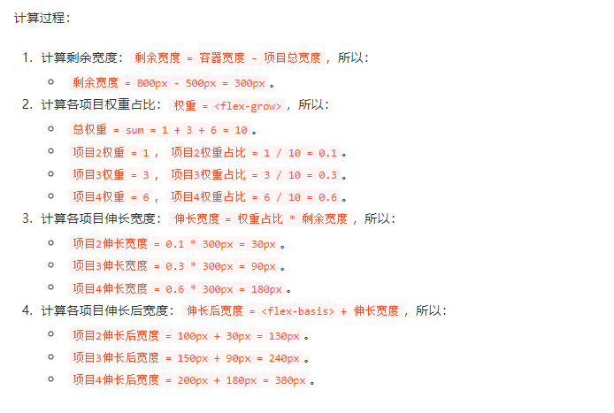
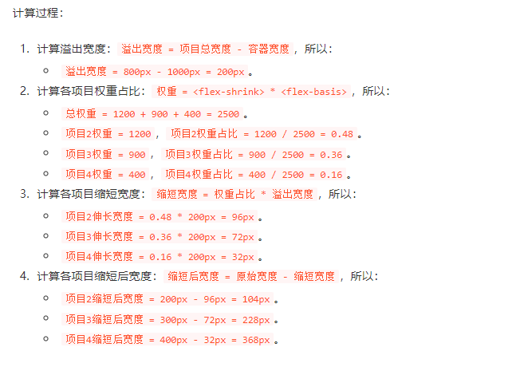
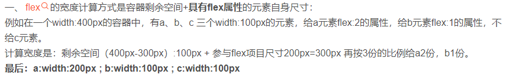
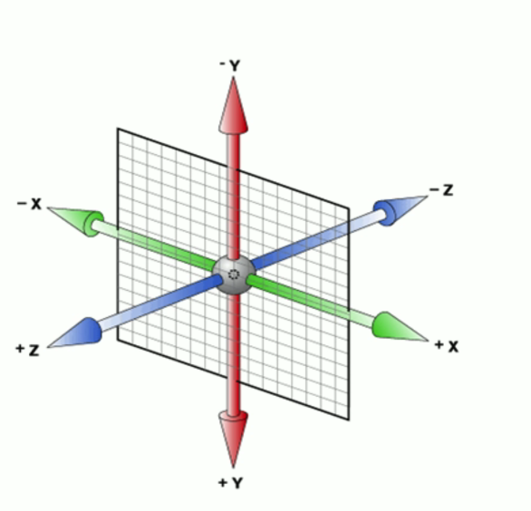

# day-009-nine-20230217-`flex布局`的`项目属性`及`transform页面转换属性`及`transition过渡效果属性`及`animation动画`

## 常见效果的思路和原理

### 鼠标移动到元素上切换背景图

### 元素变成圆

#### 元素变成实心圆

#### 元素变成空心圆

##### 元素变成空心圆，移动前后颜色产生变化

### 元素围绕某个元素产生定位效果

#### 给定元素选择器字符串，围绕这个元素产生定位效果的JavaScript方法化

### 元素变成三角形

#### 元素变成实心三角形

用边框。

- 边框颜色
- 边框长度

#### 元素变成空心三角形

两个三角形，一个颜色与`主背景`不一样，一个颜色与`主背景`一致。之后用定位。

#### 对话框

对话框有定位，之后对话框背景有颜色。
`对话框的::before`设置为`对话框背景颜色`的实心三角形，与`对话框的::after`设定为与`对话框边框颜色`的实心三角形。
用绝对定位相对于对话框移动到想要位置。

### 鼠标移动到某个元素弹出弹框

弹框放在那个元素上，将那个元素设置`position`为`相对定位`或`绝对定位`或`固定定位`。
弹框设置为

## 谷歌浏览器自带截图

1. `Ctrl`+`Shift`+`I` 打开浏览器控制台。
2. `Ctrl`+`Shift`+`P` 打开浏览器浏览器运行命令条。
3. 输入`screenshot`，在出来的下拉选择中选择相应的截图命令。
    - 中文的控制台也可以不输入`screenshot`，而是输入`截图`。
4. 截图好之后，就会弹出类似于下载文件的流程，可以改名和看到。

## `flex布局`

### `容器`和`项目`的布局

- `容器`与`项目`的概念
  - 设置`display:flex;`的就是`容器`。`容器内部的子元素`就是`容器项目`。
- `容器`与`项目`的`多层嵌套`
  - `flex布局`并不会继承，所以`设置在容器上的属性`并不会继承给`子元素`。
  - `容器内项目`也可以是`项目自身子元素`的`容器`，只需在`项目`上设置`display:flex;`。

### `flex容器属性`

### `flex项目属性`

`flex项目属性`设置在`具体item项目`上。

- `order` 项目排列顺序，即排列优先级
  - 数值越小，排列越靠前，默认为`0`。
    - `0`优先于`1`优先于`10`。
  - 可以使用`负数`，支持`整数`。
    - `小数`不生效。
    - `-1`优先于`0`优先于`1`优先于`10`。
- `flex-grow` 剩余空间分配，定义`项目放大比例`。
  - 默认为`0`，即如果存在`剩余空间`，也不`放大`。
  - `flex-grow` 推算过程
    `当前项目伸长后盒子模型总宽度`=`项目原盒子模型总宽度`+(`容器总盒子模型总宽度`-`项目原总盒子模型总宽度`)*(`当前项目权重`/`项目总权重`)

    ```html
    <div class="box">
      <div class="item1">001</div>
      <div class="item2">002</div>
      <div class="item3">003</div>
    </div>
    <style>
      .box{
        width: 700px;
        height: 700px;
        display: flex;
        border: 1px solid blue;
      }
      .box>div{
        box-sizing: border-box;/* 为了计算，采用了border-box怪异盒子模型。 */
        border: 3px solid #ff0;
      }
      .item1{
        width: 100px;
        height: 100px;
        background-color: pink;
        flex-grow: 4;/*100+(700-(100+200+300))*(4/(4+3+3))=140px */
      }
      .item2{
        width: 200px;
        height: 200px;
        background-color: skyblue;
        flex-grow: 3;
      }
      .item3{
        width: 300px;
        height: 300px;
        background-color: red;
        flex-grow: 3;
      }
    </style>
    ```

    
  - `flex-grow` 使用场景
    - 两侧弹性布局
    - 中间居中布局
  - 对`margin`及`padding`的影响，看放大是对`盒子模型的总宽度`还是对`盒子模型的width属性`。
    - 是对`盒子模型总宽度`进行作用。
- `flex-shrink` 项目压缩
  - `flex-shrink` 推算过程
    
  - 一般使用场景就是同样宽高进行同比例缩小。
- `flex-basis` 项目总占用空间
  - 设置了值，则子项占用的空间为设置的值
  - 没设置或为`auto`，那子项的空间为width的值
- `flex` 该属性是`flex-grow`, `flex-shrink` 和 `flex-basis`的简写。默认值为`0 1 auto`。
  - `flex:1;`等价于`flex:1 1;`
  - `flex:0;`等价于`flex:0 0;`
  - 两个快捷值:
    - `auto`等价于`1 1 auto`
    - `none`等价于`0 0 auto`
  - `flex`推算过程:
      
- `align-self` 设置项目有与其他项目对于当前所在主轴中纵轴的对齐方式，可覆盖`容器的align-items属性`。

## `border`的属性值顺序可互换

`border: 1px solid rgb(255,255,0);`与`border: rgb(255,255,0) solid 1px;`一样。

## `transform页面转换属性`修改`CSS视觉格式化模型的坐标空间`



### `transform属性值`

- `translate位移`
  - `transform:translateX(100px);` 水平位移
  - `transform:translateY(100px);` 垂直位移
  - `transform:translate(100px,200px);` 复合位移
    - 第一个值代表的是水平位移
    - 第二个值代表的是垂直位移
- `scale缩放`
  - `transform:scale(x,y)`
    - `x`代表的是`缩放宽度的x倍`
    - `y`代表的`是缩放高度的y倍`
  - `transform:scale(n)`  同时缩放`宽度和高度`的`n倍`，是`transform:scale(n,n)`的简写
- `rotate` 代表旋转多少度，可以是负值,单位是`deg`
  - `transform:rotateX(45deg);` 代表的是`围绕着x轴`旋转`45deg`
  - `transform:rotateY(45deg)` 代表的是`围绕着y轴`进行旋转`45deg`
  - `transform:rotateZ(45deg);` 代表`围绕着z轴`进行旋转`45deg`
- `skew` 倾斜到二维平面。
  - 这种转换是一种剪切映射 (横切)，它在水平和垂直方向上将单元内的每个点扭曲一定的角度。每个点的坐标根据指定的角度以及到原点的距离，进行成比例的值调整；因此，一个点离原点越远，其增加的值就越大。
  - `transform:skewX(45deg)` 沿着X平面倾斜45deg
  - `transform:skewY(45deg)` 沿着Y平面倾斜45deg
  - `transform:skew(10deg,15deg)` 沿着x轴倾斜10deg和沿着y轴倾斜15deg
- `transform-origin` 改变元素变形时候的作用原点
  - 水平方向 `left`、 `center`、 `right`
  - 垂直方向 `top`、`center`、`bottom`
  - 一般只看到它明显作用于旋转化。

### 让一个元素在屏幕中水平垂直居中的方法

对父元素`position: relative;`以便让子元素相对父元素进行定位。
对子元素设置`position: absolute;left: 50%;top: 50%;`让子元素上边框在父元素上下的中间，子元素左边框在父元素左右的中间。
对子元素设置`transform: translate(-50%, -50%);`让`子元素向左横向位移它自身盒子模型宽度的一半`及`子元素向上纵向位移它自身盒子模型高度的一半`。

```html
<div class="box">
  <div class="item"></div>
</div>
<style>
  .box {
    width: 400px;
    height: 300px;
    border: 1px solid rgb(255, 255, 0);
    position: relative;
  }
  .item {
    width: 100px;
    height: 200px;
    background-color: pink;

    position: absolute;
    left: 50%;
    top: 50%;
    transform: translate(-50%, -50%);
  }
</style>
```

### 不脱流，优化性能的方式

  因为`transform`可以做出一些`css效果`，并且调用这个方法，不会引起其它元素位置变动导致页面重排，所以可以用它来做一些效果。

### 各种效果

- 元素显示的宽度及高度变化。
- 缩放引起注意
- 旋转转圈

## `transition过渡效果属性`

### 过渡时机

过渡一定需要一个时机，常见时机:

1. `:hover`等伪类
2. 用`JavaScript`给元素`增加`或`删除`class类名导致样式变动。
3. 用`JavaScript`修改`css样式`。
4. 子元素`新增`或`删除`导致的宽高变化等

### 过渡属性

- `transition-property` 过渡的属性
  - 如果是多个属性可以用逗号隔开
- `transition-duration` 过渡执行一次的总时间
- `transition-timing-function:linear;` 过渡效果的运动曲线
- `transition-delay:1s;` 过渡执行前的延迟时间

### 复合属性

`transition:all 2s linear 1s;`

- 顺序随意
  - 第一个时间必定是过渡全部所需时间
  -
- 推荐使用复合属性

## `z-index当前堆叠上下文中的堆叠层级定位层级`

- 层级一样，`源代码`中`位于后面的定位元素`优先显示
- `auto` 默认值，盒子不会创建一个`新的本地堆叠上下文`。
  - 在`当前堆叠上下文`中生成的盒子的`堆叠层级`和`父级盒子`相同。
- `整型数字` 是`生成的盒子`在`当前堆叠上下文`中的`堆叠层级`。
  - `此盒子`也会创建一个`堆叠层级`为`0`的`本地堆叠上下文`。
    - 意味着`此盒子后代元素`的`z-indexes`不与此元素的外部元素的`z-indexes`进行对比。
  - 可以使用负数，正常元素可看作是`0`?
  - 小数无效，相当不设置值。

## `animation动画`

### 步骤

1. 定义动画
    - 用`keyframes`定义动画名 其实`keyframe`就是`慢慢改变样式的过程`

      ```css
      @keyframes 动画名 {

        /* 动画序列 */
        /* 0%是动画的开始 */
        0% {
          width: 100px;
        }
        
        /* 50%是动画运行到50%的时候 */
        50% {
          width: 100px;
        }

        /* 100%是动画的结束 */
        100% {
          width: 200px;
        }
      }
      ```

      或

      ```css
      @keyframes 动画名 {
        /* from是动画的开始 */
        from{
          transform: translateX(0px);
        }

        /* to是动画的结束 */
        to{
          transform: translateX(400px);
        }
      }
      ```

2. 调用动画
    - `animation-name` 指定`要绑定到选择器的关键帧`的名称
    - `animation-duration` 指定动画需要`多少秒`或`毫秒`完成

### 动画的属性

- `animation-name: 要执行动画的名称;` 动画名称 (必须写，动画才能运行)
- `animation-duration: 2s;` 动画运行一次所需时间 (必须写，动画才能运行)
- `animation-timing-function: ease;` 动画运行的运动曲线
- `animation-delay: 2s;` 动画延迟多久才开始运行
  - 默认是0s
- `animation-iteration-count: infinite;` 规定动画运行的次数  
  - 可以是数字
    - 也可以是`infinite`
- `animation-direction: alternate;` 动画运行一次之后是否反方向再运行一次
  - `默认normal`
  - `反方向alternate`
    - `反方向`也耗费`animation-iteration-count`的一次
- `animation-fill-mode: forwards;` 是否回到起始状态
  - 默认是`backwards`
  - 在原地不回来了`forwards`
- `animation-play-state` 定义一个动画是否`运行`或者`暂停`。
  - 通过`JavaScript`查询该属性来`确定动画是否正在运行`。
  - 该属性值可以被设置为`暂停`和`恢复`的，进而导致`动画的继续进行`。
    - 恢复一个`已暂停的动画`，将从`动画开始暂停`的时候，而不是从`动画序列的起点`开始`恢复`。
  - 可选值
    - `running` 默认值，当前动画正在运行。
    - `paused` 当前动画已被停止。

### 动画例子(鼠标经过这个盒子，让他停止动画)

```html
<!DOCTYPE html>
<html lang="en">
  <head>
    <meta charset="UTF-8" />
    <meta name="viewport" content="width=device-width, initial-scale=1.0" />
    <title>Document</title>
    <style>
      div {
        width: 100px;
        height: 100px;
        background-color: lavender;

        /* 2、调用动画 */
        animation-name: run; /* 动画名称 */
        animation-duration: 2s; /* 持续时间 ：盒子从左到右花费的时间*/
        animation-timing-function: ease; /* 运动曲线 默认ease*/
        animation-delay: 2s; /* 动画延迟多久开始 默认是0s */
        animation-fill-mode: forwards; /* 是否回到起始状态 默认是backwards  在原地不回来了forwards  */
      }

      /* 其实keyframe就是慢慢改变样式的过程 */
      @keyframes run {
        /* 动画序列 */
        /* 0%是动画的 开始 */
        0% {
          transform: translateX(0px);
        }

        /* 动画关键帧 */
        50% {
          transform: translateX(200px);
        }

        /* 100%是动画的结束 */
        100% {
          transform: translateX(400px);
        }
      }

      div:hover {
        animation-play-state: paused; /* 暂停动画 */
      }
    </style>
  </head>

  <body>
    <div></div>
  </body>
</html>
```

### 简写(推荐)

`CSS`中`animation属性`是 `animation-name`，`animation-duration`, `animation-timing-function`，`animation-delay`，`animation-iteration-count`，`animation-direction`，`animation-fill-mode` 和 `animation-play-state` 属性的一个简写属性形式。

## 今日感兴趣

1. [从零开始，手把手教你Window本地化部署stable diffusion AI绘图](https://www.toutiao.com/article/7159479479516119593/)
2. [10分钟Window本地部署stable diffusion AI绘图【新手教程】](https://www.dongchuanmin.com/windows/4223.html)
3. [transition-过渡效果属性](https://developer.mozilla.org/zh-CN/docs/Web/CSS/transition)
4. [transform-修改 CSS 视觉格式化模型的坐标空间](https://developer.mozilla.org/zh-CN/docs/Web/CSS/transform)
5. [animation-动画效果](https://developer.mozilla.org/zh-CN/docs/Web/CSS/animation)

## 进阶参考

1. [skew()](https://developer.mozilla.org/zh-CN/docs/Web/CSS/transform-function/skew)
2. [过渡运行曲线-CSS3贝塞尔曲线工具](http://web.chacuo.net/css3beziertool/)
