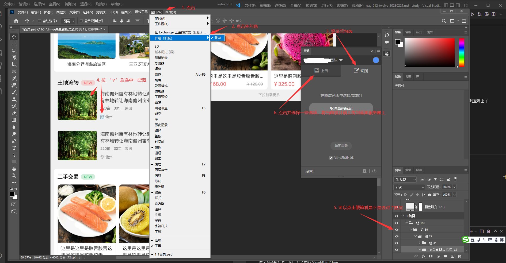

# day-012-twelve-20230221-移动端如rem及屏幕相关及蓝湖及上下固定但中间可滚动的实现方案

## 移动端

### pc端和移动端

#### 产品形态-域名 `不同公司的不同项目`的`全平台方案`有所不同

- 同一域名: 这些网页一般就是做了`媒体查询`，`移动端`及`PC端`共同用`一套`代码
  - 例子
      1. [华为官网首页](https://www.huawei.com/cn/)
      2. [苹果官网首页](https://www.apple.com/cn/)
  - 这些网页就是用了`媒体查询`或者是`自适应方案`来解决`不同屏幕的问题`的。
- 不同域名: `pc端`和`移动端`用两个域名的，`pc端`和`移动端`分别做了一个。共`两套`代码
  - 例子
      1. [小米pc](https//www.mi.com/)与[小米移动](https://m.mi.com/)
      2. [京东pc](https://www.jd.com/)与[京东移动](https://m.jd.com/)
  - 这些网页就是移动端直接用`rem`之类的来做
- 当`结构比较简单`的时候，可以共用一套。
  - 当`结构比较复杂`可以写两套。

#### `pc端`和`移动端`的区别

- 事件上的区别
  - `pc端`有`鼠标相关事件`，并且主要使用`鼠标相关的事件`
  - `移动端`主要使用`与手指相关的一些事件`
- 浏览器兼容性
  - `pc端`需要考虑`各个浏览器的兼容性问题`
  - `移动端`不需要考虑`各个浏览器的兼容问题`，它的内核就是`webkit`和谷歌一样
- 屏幕上的区别
  - `移动端`各个手机屏幕不一样大，而且机型不同，有时候也会有一定的兼容问题
  - `PC端`一般都有`1080px`，基本上不用太过考虑用户屏幕的问题

### 屏幕基本概念

- 尺寸
  - `屏幕尺寸`是以`屏幕对角线的长度`来计量，`计量单位`为`英寸`
- 分辨率
  - `设备像素`也叫`物理像素`，指的是`显示器上的真实像素`，每个`像素的大小`是`屏幕固有的属性`，`屏幕`出厂以后就`不会再改变`。
  - `设备分辨率`描述的就是`显示器的宽和高分别是多少个设备像素`
- `独立像素`，即`逻辑分辨率`
  - `设备独立像素`是`操作系统定义的一种像素单位`，`应用程序`将`设备独立像素`告诉`操作系统`，`操作系统`再将`设备独立像素`转化为`设备像素`，从而控制屏幕上真正的`物理像素点`。
  - `逻辑分辨率`：`375`*`667`
- `设备像素比`
  - `物理像素`和`设备独立像素`的比值。
  - 英文名为`device pixel ratio`简称`dpr`
- `像素密度PPI`
  - `每英寸中显示的像素数`，通常使用`ppi`来作为`像素密度的单位`
  - `ppi`=`屏幕对角线的分辨率`/`屏幕对角线的英寸长度单位`=(((`屏幕横向分辨率`^`2`)+(`屏幕纵向分辨率`^`2`))^(1/2))/`屏幕对角线的英寸长度单位`
- `视口`
  - `布局视口`
    - html元素的`宽度`和`高度`对应的视口
  - `视觉视口`
    - `屏幕`
  - `理想视口`
    - 对设备来说是一个`最理想布局视口尺寸`，在`用户`不进行`手动缩放`的情况下，可以将`页面`理想地`展示`。
    - 配置视口
      - 使用`<meta/>标签`，即`<meta name="viewport" content="width=device-width, initial-scale=1.0">`
        - 规定了`视口宽度`为`屏幕宽度`，`初始缩放比例`为`1`，代表`初始时候的视觉视口`就是`理想视口`

### 相对单位

- `em`
  - `当前元素font-size`的`一倍像素`就是`1em`。
    - `当前元素font-size`来源可能是`继承`。也可能是自己设置的。
- `rem`
  - 相对于`根标签html元素`的`font-size`。
- `vw`(viewport width)
  - `屏幕视口宽度`的`百分之一`。`1vw`=`1%视口宽度`
- `vh`(viewport height)
  - `屏幕视口高度`的`百分之一`。`1vh`=`1%视口高度`
  
### 移动端适配

`手机屏幕尺寸`不一样，`分辨率`不一样，导致`同样的一个像素大小`在`不同手机`上会有`不同的展示效果`。

#### 为什么要适配

一般情况下`设计稿的设计师`按照`375`*`667`的尺寸设计。

然而，在现在`移动终端`（就是`手机`）快速更新的时代，`每个品牌的手机`都有着不同`的物理分辨率`，这样就会导致，每台设备的`逻辑分辨率`也不尽相同。

对于`375`*`667`的设计稿，如果想要还原那基本是不可能了，因为如果一个左右布局，左边如果写死，右边自适应的话，每个设备的`右边所展示的内容大小`就不尽相同，`移动端适配`就显得尤其重要。

#### 移动端适配方法

如果纯粹用之前所说的`媒体查询`，那么代码就会很多，写起来也不是很方便。

##### 由`px单位`改为`rem单位`

使用`rem`为`元素`设定`字体大小`时，仍然是相对大小，但相对的只是`HTML根元素`。

拿到`设计稿`的时候，按照`设计稿的尺寸`去写，然后通过更改一个值，就能更改页面中所写的css的尺寸。
那么实现思路就是根据`移动端屏幕`的改变，同时根据`js事件`也同时改变`HTML根元素`的`字体大小`，就可以达到目的。

###### rem思路

`rem` 是相对于`html节点`的`font-size`来做计算的。所以在`页面初始化`的时候给`根元素`设置一个`font-size`，接下来的元素就根据`rem`来布局，这样就可以保证在页面大小变化时，布局可以自适应，那么在开发页面时把`设计稿的px`转换成`对应的rem单位`即可。

思路:
在页面初始化的时候，用`屏幕宽度像素`除以`设计稿宽度`得到一个`比值A`。
通过这个`比值A`，比如`设计稿宽度`*`比值A`就是`屏幕宽度像素`，也就是说就相当于`一个屏幕的大小`了。

```js
(function () {
  function computed() {
    const desginWidth = 375//设计稿宽度，一般就是375px
    const clientWidth = document.documentElement.clientWidth//用户窗口宽度-单位为像素
    const scale = clientWidth / desginWidth//`比值A`
    document.documentElement.style.fontSize = `${scale}px`
  }
  computed();
  window.onresize = function () {
    computed();
  }
})();
```

### 计算属性

- `calc()`
  - `calculation`的简写
  - 不推荐使用

## 蓝湖

下载[蓝湖Photoshop插件](https://lanhuapp.com/ps)，之后安装到电脑上，就可以在`Photoshop`上用`该插件`上传`设计稿`到`蓝湖`上了。

还可以使用`这个插件`进行`切图`。

### 注册

注册`蓝湖帐号`。

- [蓝湖官网](https://lanhuapp.com/)

### 切图


`英文按键状态`下在`Photoshop`中按`v`，允许`光标`可以`选中图层`。

### 上传

`上传`后就可以在`web端`上看到`设计稿`了。具体使用自己去试。


## 上下固定但中间可滚动的实现方案

### 使用固定定位加margin

思路:
结构为`div#app>(div.header+div.main+div.footer)`。
上方`div.header`和下方都设置为`width: 100%;position: fixed;`，并设置`div.main`的`margin-top`与`margin-bottom`

```html
<!DOCTYPE html>
<html lang="en">
  <head>
    <meta charset="UTF-8" />
    <meta http-equiv="X-UA-Compatible" content="IE=edge" />
    <meta name="viewport" content="width=device-width, initial-scale=1.0" />
    <title>移动聊天样式1-使用固定定位加margin</title>
    <style>
      #app {
        background-color: skyblue;
      }
      .main {
        background-color: yellow;
        height: 5000px;
      }
      .header,
      .footer {
        background-color: pink;
      }

      .header,
      .footer {
        position: fixed;
        height: 100px;
        width: 100%;
      }
      .header {
        top: 0;
      }
      .footer {
        bottom: 0;
      }
      .main {
        margin-top: 100px;
        margin-bottom: 100px;
      }
    </style>
  </head>
  <body>
    <div id="app">
      <div class="header">头部</div>
      <div class="main">主体内容</div>
      <div class="footer">尾部</div>
    </div>
  </body>
</html>
```

### 使用`css计算函数calc`及`overflow`

思路:

```html
<!DOCTYPE html>
<html lang="en">
  <head>
    <meta charset="UTF-8" />
    <meta http-equiv="X-UA-Compatible" content="IE=edge" />
    <meta name="viewport" content="width=device-width, initial-scale=1.0" />
    <title>移动聊天样式2-使用css计算函数calc及overflow</title>
    <style>
      #app {
        background-color: skyblue;
      }
      .header,
      .footer {
        height: 100px;
        width: 100%;
        background-color: pink;
      }
      .main {
        background-color: yellow;
      }
      .body-content{
        height: 5000px;
      }

      #app {
        height: 100vh;
      }
      .main {
        height: calc(100% - 100px - 100px);
        overflow: auto;
        background-color: yellow;
      }
    </style>
  </head>
  <body>
    <div id="app">
      <div class="header">头部</div>
      <div class="main">
        <div class="body-content">主体内容</div>
      </div>
      <div class="footer">尾部</div>
    </div>
  </body>
</html>

```

### 使用`flex布局`及`overflow`

思路:

```html
<!DOCTYPE html>
<html lang="en">
  <head>
    <meta charset="UTF-8" />
    <meta http-equiv="X-UA-Compatible" content="IE=edge" />
    <meta name="viewport" content="width=device-width, initial-scale=1.0" />
    <title>移动聊天样式3-使用flex布局及overflow</title>
    <style>
      #app {
        background-color: skyblue;
      }
      .header,
      .footer {
        height: 100px;
        width: 100%;
        background-color: pink;
      }
      .main {
        background-color: yellow;
      }

      #app {
        height: 100vh;

        display: flex;
        flex-direction: column;
      }
      .main {
        flex: 1;
        overflow: auto;
      }
      .body-content {
        height: 5000px;
      }
    </style>
  </head>
  <body>
    <div id="app">
      <div class="header">头部</div>
      <div class="main">
        <div class="body-content">主体内容</div>
      </div>
      <div class="footer">尾部</div>
    </div>
  </body>
</html>

```

## 进阶参考

1. [蓝湖Photoshop插件](https://lanhuapp.com/ps)
2. [蓝湖官网](https://lanhuapp.com/)
