# day-016-sixteen-20230227-`JavaScript引入方式`及变量与变量值类型及基础类型转化与number包装对象的常用方法及object对象及属性的增删改查

## JavaScript

1. 只写几行基本上看不到效果。
2. `JavaScript代码`是`从上到下`并`从左到右`依次执行一遍的。

## 浏览器内核

- `Gecko` 火狐浏览器
- `Webkit` Safari浏览器
- `blink` Chrome浏览器，基本上大多浏览器的内核
- `Presto` 欧朋浏览器，但欧朋浏览器已经改`blink`

## `JavaScript历史`

- 1995，网景的一个员工10天制作，主要是为了`验证表单元素`。
- 1997，`ECMA`成立并制定规则。为了`JavaScript`不因浏览器大战分裂而建立。
- 1999，`ES3.0`版本发布。
- 2007，`ES4.0`被废弃。
- 2009，`ES5`正式发布。
- 2015，`ES6`正式发布，命名为`ES2015`。
以后每年更新一个版本，以年号命名。

## `JavaScript构成`

- `ECMAScript规则`，`JavaScript核心`。
- `DOM文档对象模型`，操作标签及标签属性的。
- `BOM浏览器对象模型`，操作窗口，浏览历史，数据存储等。

## `JavaScript定义`

`JavaScript`是一种`直译式脚本语言`，是一种`动态类型`、`弱类型`、`基于原型`的`语言`，内置`支持类型`。

## JavaScript引入方式

`html文件`需要引入`JavaScript代码`，才能在`页面里`使用`JavaScript代码`。

- `静态引入`

    1. `行内式` 直接在`DOM标签`上使用

        ```html
        <!DOCTYPE html>
        <html lang="en">
        <head>
          <meta charset="UTF-8">
          <title>JavaScript引入方式</title>
        </head>
        <body>
          <div onclick="alert(1111)">行内式</div>
        </body>
        </html>
        ```

    2. `内嵌式` 写在`script标签`内

        ```html
        <!DOCTYPE html>
        <html lang="en">
        <head>
          <meta charset="UTF-8">
          <title>JavaScript引入方式</title>
        </head>
        <body>
        </body>
          <script>
            alert('内嵌式')
          </script>
        </html>
        ```

    3. `外链式` 通过`script标签`引入`js文件`

        ```html
        <!DOCTYPE html>
        <html lang="en">
        <head>
          <meta charset="UTF-8">
          <title>JavaScript引入方式</title>
        </head>
        <body>
        </body>
        <script src="./index.js"></script>
        </html>
        ```

        与`html文件`同一目录下的`./index.js`:

        ```js
        alert('外链式')
        ```

- `动态引入`
  代码可以手动用代码拼接写出来，也可以用ajax请求并使用。

  思路:
    1. 在`js运行过程`中，构建`script标签`并插入到`DOM文档`中，或者通过`引用链接`，把`已经写好的js文件`通过`script标签`插入到`DOM文档`。
      - 使用`原生JavaScript`中提供的动态加载`<script>元素`的方法，可以创建`<script>元素`，并将其添加到 `HTML文档`中，以动态加载`JS文件`或`代码`。
        - 添加方法可以使用
          - `document.body.appendChild(script标签元素);`
          - `document.write()` 如`document.write('<script src="https://example.com/example.js"></script>');`;

        - 手写的js代码

            ```js
            const script = document.createElement("script");
            script.innerHTML = 'console.log("DOM动态创建并运行脚本+预加载优化");';//这些代码可以手动用代码拼接写出来，也可以用ajax请求并使用。
            document.body.appendChild(script);
            ```

        - 引入外链js代码

            ```js
            setTimeout(() => {
              console.log(1, window.fang);//1 undefined;
              const script = document.createElement("script");
              script.src = "./动态js文件.js";
              document.body.appendChild(script);
              console.log(2, window.fang);//2 undefined;
            }, 0);
            setTimeout(() => {
              console.log(3, fang);//{fang: '方一'};
            }, 3000);
            ```

            同一目录下`动态js文件.js`

            ```js
            console.log("这个就是动态js文件");
            var fang = { fang: "方一" };//{fang: '方一'};
           ```

    2. 通过`import()`动态模块。
      - 使用`ES6`中引入的`import()`方法动态加载`JS模块`，该方法可以`在运行时动态地`加载`JS模块`。
        - 引入外链js代码

            ```js
            async function loadJSModule() {
              const module = await import("./动态js模块.js");
              //console.log("module--->", module);
              // 加载成功后可以使用该模块
              module.fang.theFunction();//Symbol("动态js模块里的东西");
            }

            loadJSModule();
            ```

            同一目录下`动态js模块.js`

            ```js
            console.log("这个就是动态js模块");//这个就是动态js模块
            const theSymbol = Symbol("动态js模块里的东西");
            let fang = {
              fang1: "方一",
              theFunction: () => {
                console.log(theSymbol);
              },
            };
            export { fang };
           ```

    3. 使用`AJAX技术`加载`JS代码`，可以通过`XMLHttpRequest`或`fetch方法`动态加载`JS代码`，并使用`eval('JS代码')`或`Function('JS代码')()`方法执行代码。
        - 引入外链js代码

            ```js
            const xhr = new XMLHttpRequest();
            xhr.open("GET", "./动态js文件.js");
            xhr.onload = function () {
              if (xhr.status !== 200) {
                return;
              }
              eval(xhr.responseText);
              //(new Function(xhr.responseText))()
              console.log(3, fang); //{fang: '方一'};
            };
            xhr.send();
            ```

            同一目录下`动态js文件.js`

            ```js
            console.log("这个就是动态js文件");
            var fang = { fang: "方一" };//{fang: '方一'};
           ```

- `<script></script>标签`里如果设置了`src属性`，那么，`它内部的代码`将会`被忽略`。
  - 如果`<script></script>标签`的`src`为`空字符串`，那么`该<script></script>标签内容将`无效，并且不引入`外部js代码`。相当于该`<script></script>标签`废了。

      ```html
      <script src="">
        //由于`src=""`，该script标签将失效。
        console.log('不生效，并不会被打印。')
      </script>
      ```

## 变量

### 变量相当于数据的容器

- 变量如果没定义，就直接使用会报错。

  ```js
  fang//Uncaught ReferenceError: fang is not defined
  ```
  
- 变量(容器，可以认为是数据的容器)
  - 先声明+后定义(赋值)

      ```js
      var box;//var 是固定的一个关键字，它的作用是定义一个变量。box是变量，只要遵循命名规范随便起名。没赋值前，值为undefined。
      box = 100
      ```

  - 既声明又定义

      ```js
      var box = 100;
      ```

- var关键字
  - 会把声明的全局变量放到window上，成为window的一个同名属性值。
- 变量的值会随着从下到下依次的赋值依次变化，并不会说一成不变。

### 变量命名规范

1. 区分大小写
   - `var box = 100;`与`var Box = 100;`是不同的。
2. 名字以`数字`，`字母`、`_下划线`、`$美元符号`组成，但是不能`以数字开头`。
    - 可以使用中文字符等`一些Unicode字符`。
3. 不能是关键字或者保留字。
    - 关键字，就是代表特殊含义和功能的名字。
      - `var`、`function`、`break`、`else`、`new`、`var`、`case`、 `finally`、`return`、`void` 、`catch`  、`for`  、`switch` 、`while` 、`continue`、`this` 、`with` 、`default` 、`if` 、`throw` 、`delete` 、`in` 、 `try` 、`do` 、`instanceof`、 `typeof`
    - 保留字，就是现在还不是关键字，但是以后有可能会被规定成关键字，预先保留着。
      - `abstract`、`enum`、`int`、`shor`t、`boolean` 、`export` 、`interface`、 `static`、 `byte` 、`extends`、`long`、`super`、`char`、`final` 、`native` 、`synchronized`、`class` 、`float`、`package` 、`throws`、`const` 、`goto` 、`private`、`transient`、`debugger`、`implements` 、`protected`、`volatile`、`double` 、`import` 、`public`

4. 命名要有语义化

    - 虽然也可以使用`中文`或`拼音`，但为了`与其它人同步`，应`尽量使用英文`
    - `一个单词`时
      - `小写`
        - 定义`变量`
          - `名词`为`正常变量`
          - `动词`为`函数名`
          - 示例: `name`
      - 全大写
        - 常用于定义`常量`
          - 示例: `NAME`
      - 大驼峰命名法
        - `类名`，`构造函数名`
        - 示例: `Name`
      - 前缀为`下划线_`
        - 类里面的`私有属性`或`私有变量名`
        - 示例: `_name`
    - `多个单词`时
      - `小驼峰命名法`（`驼峰命名法`）：`首单词的首字母`小写，`其余单词的首字母`大写
        - 示例: `myName`
      - `大驼峰命名法`(又叫`帕斯卡命名法`)：每个单词的首字母都大写
        - `类名`，`构造函数名`
        - 示例: `MyName`
      - `下划线命名法`：要求`单词`与`单词`之间通过`下划线`连接即可
        - 全小写，用`下划线`连接
          - 示例: `my_name`
        - 全大写，用`下划线`连接
          - 常用于定义常量
          - 示例: `MY_NAME`

## 变量值类型

- `值类型`/`原始值类型`/`基本数据类型`
  - `number` 数字
    - 有效数字
      - 十进制数
        - `1` `1.1` `-3` `-9.25`
      - `Infinity` 无限
      - 非十进制数
        - `0b数字`、`0B数字` 二进制
        - `0数字`、`0o数字`、`0O数字` 八进制
        - `0x数字`、`0X数字` 十六进制
    - 非有效数字 `NaN`
  - `string` 字符串
    - `''` 用单引号包起来的
    - `""` 用双引号包起来的
    - **``** 用反引号包起来的，也叫模版字符串或多行文本字符串
  - `boolean` 布尔值
    - `true`
    - `false`
  - `null` 空
  - `undefined` 未定义
  - `symbol` 唯一值
    - `Symbol()`
    - `Symbol('唯一值标记说明')`
  - `bigint` 大数，浏览器控制台会原封不动地打印出来，而不会用科学计数法去表示
    - `65245553155354695421345464587n`
- 对象类型/引用数据类型

## 数据转换

- `非number类型`转为`number类型`
  - `Number()`
    1. `字符串`转为`number`
          - `有效数字`转为`正常十进制数字`
            - 会忽略字符串前后的空格
            - `Number('0x10')//16`
            - `console.log(Number('1.1'));//1.1`
            - `console.log(Number('10px'));//NaN`
            - `console.log(Number('-10'));//-10`
            - `console.log(Number('true'));//NaN`
            - `console.log(Number(''));//0`
            - `console.log(Number('     '));//0`
            - `console.log(Number('  7  '));//7`
          - `非有效数字`就是转为`NaN`
    2. `布尔值`转为`number`
          - `console.log(Number(true));//1`
          - `console.log(Number(false));//0`
    3. `null`转为`number`
        - `console.log(Number(null));//0`
    4. `undefined`转为`number`
        - `console.log(Number(undefined));//NaN`
        - `console.log(Number());//0`
    5. `symbol`转为`number`
        - 会报错，`symbol`不能转为`number`
        - `Number(Symbol('唯一值'));//Uncaught TypeError: Cannot convert a Symbol value to a number;`
    6. `bigint`转为`number`
        - `超过范围`就使用`科学计数法`表示
          - `Number(11123456987456987123456789n);//1.1123456987456987e+25`
        - `不超过范围`就`正常显示`
          - `Number(1112345n);//1112345`
        - 可以理解为都`正常转成数字`了，但`数字如果太大`，就会使用`科学计数法`表示，同时`数字`对于`太大的数`本身就会`损失精度`。

- `其它数据类型`转为`string类型`
  - `String()`
  - 总结 直接加引号，
- `其它数据类型`转为`boolean类型`
  - 除了`null`、`undefined`、`NaN`、`0`、`空字符串''`以外，都为`true`。

### nubmer常用方法

- `parseInt(string, radix)` 解析`一个字符串`并返回`指定基数的十进制整数`，`radix` 是`2-36`之间的整数，表示被解析字符串的基数。
  1. `被解析的值`得是`一个字符串`，如果`不是`，需要用`toString()这个方法`转为`字符串`，再去`解析`。
  2. 从左往右`依次解析`，直到遇到`非有效数字`，就`停止`。
     - 如果`第一个`就是`非有效数字`，就`直接停止`。
        - `parseInt('k12.3');//NaN`
  3. 空字符串被解析为NaN。
  4. 示例:
      - `parseInt(100.3)//100`
      - `parseInt(true)//NaN`
      - `parseInt('')//NaN`
- `parseFloat()` 解析一个参数并返回一个浮点数。
  1. `被解析的值`得是`一个字符串`，如果`不是`，需要用`toString()这个方法`转为`字符串`，再去`解析`。
  2. 从左往右`依次解析`，直到遇到`非有效数字`，就`停止`。
     - 如果`第一个`就是`非有效数字`，就`直接停止`。
       - `parseFloat('k12.3');//NaN`
  3. `空字符串`被解析为`NaN`。
      - `parseFloat(100.3)//100.3`
      - `parseFloat('100.3px')//100.3`
      - `parseFloat(true)//NaN`
      - `parseFloat('')//NaN`
- `isNaN()` `被解析的值`得是`number类型`，如果不是，就用`Number()`来转成`number`，再来判断是不是`NaN`。
  - `isNaN(100);//false;//100是NaN吗? ---> 不是(false)`
- `toFixed()` 使用`定点表示法`来`格式化`一个数值。
  - 但不一定`四舍五入`，有时直接`舍去不入`，有时`五舍六入`。
    - 原因是因为`浮点数在内存中存储`的问题。
  - `(2.33335).toFixed(4);//'2.3333'`
  - `(2.33336).toFixed(4);//'2.3334'`
  - `(2.653).toFixed(1);//'2.7'`
- `BigInt()` 要想`不损失精度`，`里面`最好是`一个字符串`。
  - `BigInt(98765432100123456789);//98765432100123459584n;` 使用`正常数字`，后面`数字精度`损失了。
  - `BigInt('98765432100123456789');//98765432100123456789n;` 使用`字符串`，`精度`依旧正常。
  - `BigInt(98765432100123456789n);//98765432100123456789n;` 使用`BigInt`，`精度`正常。
- `最大安全整数`
  - `Number.MAX_SAFE_INTEGER` 相当于`(2**53)-1`
- `最小安全整数`
  - `Number.MIN_SAFE_INTEGER` 相当于`-(2**53)+1`

## object普通对象

- 字面量表示法:

  ```js
  {属性名1:属性值1,属性名2:属性值2,}
  ```

- 对象属性组成

    ```js
      var obj={num:100,age:18}
    ```

    `num` : `属性名`(`键`/`key`)
    `100` : `属性值`(`值`/`value`)
- `属性值`可以是`任意数据类型`或`变量`，
  - 换句话说必须是`某一种数据类型`,因为`变量`归根结底也是`某一种数据类型`。
- `属性名`可能是`字符串`或者`symbol类型`，或者是`数字`

### `变量属性`的`增删改查`

- `查`
  - `点语法`
    - `点语法`不能`带引号`
    - `属性名`是`数字`时，不能`用点语法`
    - `属性名`是`symbol类型`时，不能`用点语法`
  - `中括号语法`
    - 查找`对应属性名`时，`中括号语法`一定要`带引号`
    - `属性名`是`数字`，可以`带引号`也可以`不带引号`
    - `不带引号`就默认是`变量`
      - 如果`该变量`没被创建，就会报错 `xxx is not defined`
      - 如果`该变量`被创建，就会把`该变量的值`放到中括号中。
        - `var obj={0:'属性名为0的属性值'};console.log(obj[length]);//'属性名为0的属性值'`
        - 在`obj`上找不到`length`这个属性名，就会去找上一级作用域，如果还找不到，就到`window`上找。结果`window.length`有值且为`0`，那么`obj[0]`就等于`'属性名为0的属性值'`。
        - `var obj={0:'属性名为0的属性值'};console.log(obj[length]);`  相当于: `obj[length]` => `obj[window.length]`,同时`window.length`为`0` => `obj[0]` => `obj['0']` => `'属性名为0的属性值'`。
  - 在对象中查找一个`不存在的属性`，那么值为`undefined`。
- `删`
  - `软删除` 设置值为`null`或`undefined`

      ```js
      var obj = { name: "name", age: 100 };
      obj.name = undefined;
      console.log(obj);//{name: undefined, age: 100}
      ```

      ```js
      var obj = { name: "name", age: 100 };
      obj.name = null;
      console.log(obj);//{name: null, age: 100}
      ```

  - `硬删除` 使用`delete关键字`

      ```js
      var obj = { name: "name", age: 100 };
      delete obj.name
      console.log(obj);//{age: 100}
      ```

- `增`
  - 有则`修改`，无则`新增`
      1. 只能增加`字符串`和`symbol`

          ```js
          var obj = {}
          obj[true]="true";
          obj[{a:0}]="object";
          console.log(obj)//{true: 'true', '[object Object]': 'object'};//无论什么对象，转字符串都是'[object Object]';
          ```

      2. `属性名`不能`重复`，如果`重复`了，就相当于`覆盖旧属性`
      3. 新增`symbol属性值`，

          ```js
          var obj = {}
          var theSymble = Symbol('Symbol注释')
          obj[theSymble] = '属性值'
          console.log(obj[theSymble])//'属性值';
          ```

- `改`
  - 有则修改，无则新增
      1. 只能修改前对象上必须有对应的属性，如果没有，就相当于新增了

          ```js
          var obj = {true: 'true', '[object Object]': 'object'}
          obj[true]="true改";
          obj[{a:0}]="object改";
          console.log(obj)//{true: 'true改', '[object Object]': 'object改'};//无论什么对象，转字符串都是'[object Object]';
          ```

## `VSCode`配置`代码片段`

- 配置`VSCode代码片段`
    1. 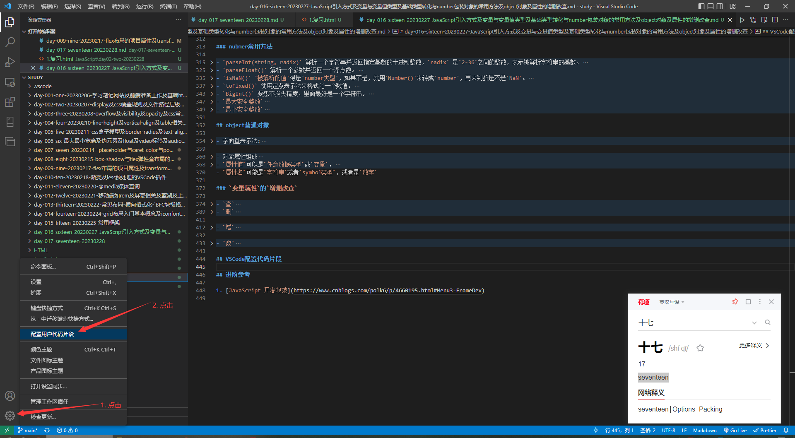
    2. 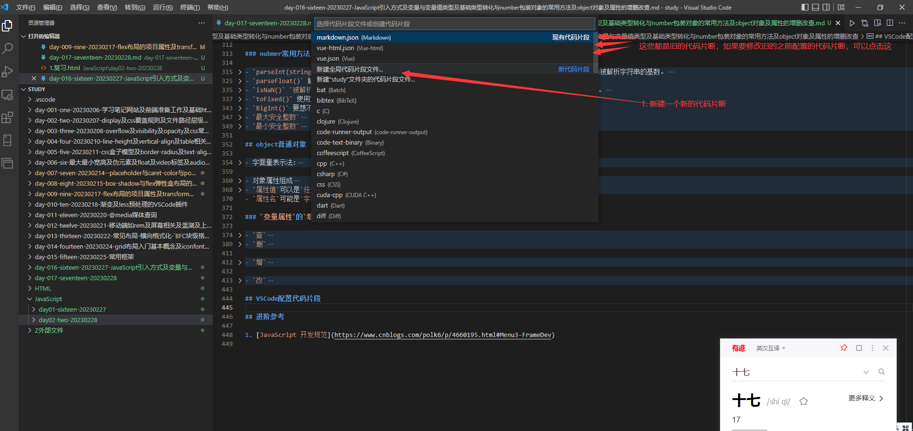
    3. 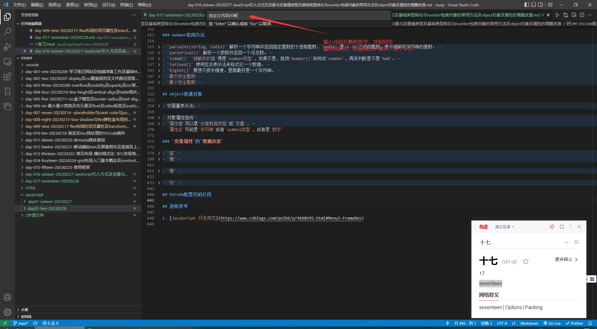
    4. 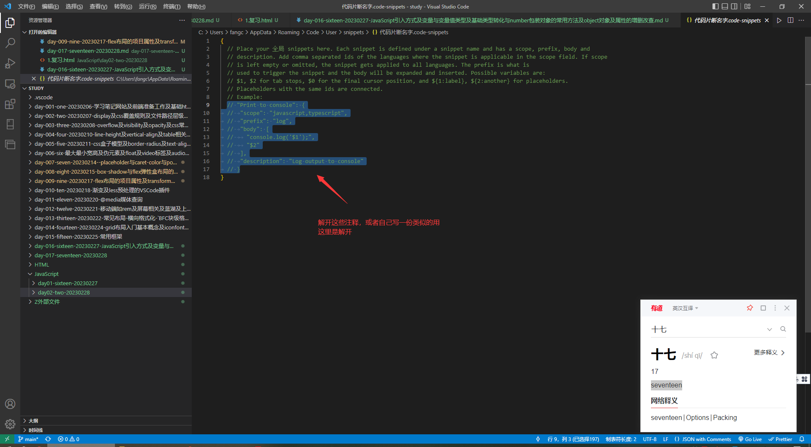
    5. 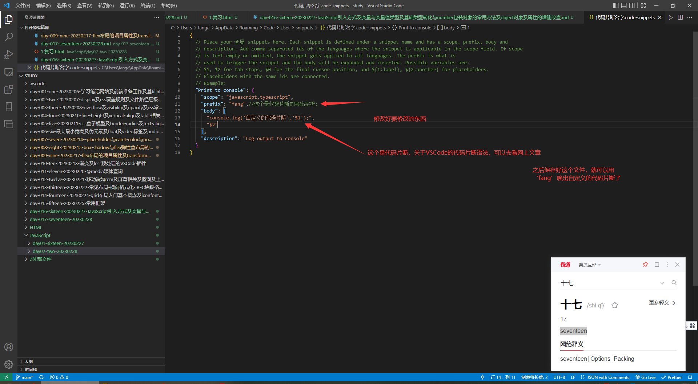
    6. 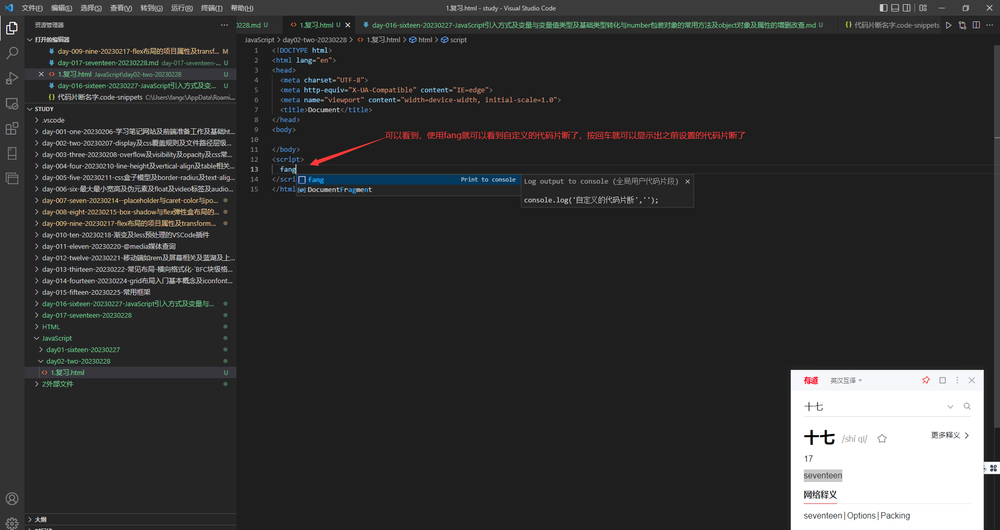
- 删除`VSCode代码片段`
    1. 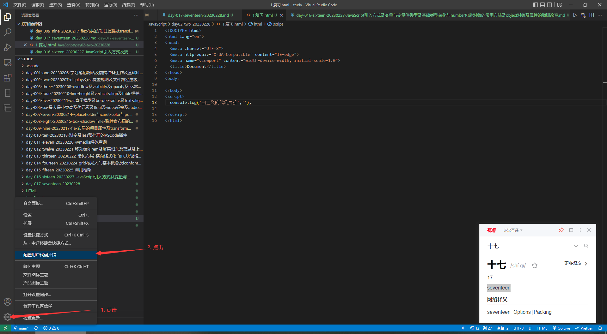
    2. 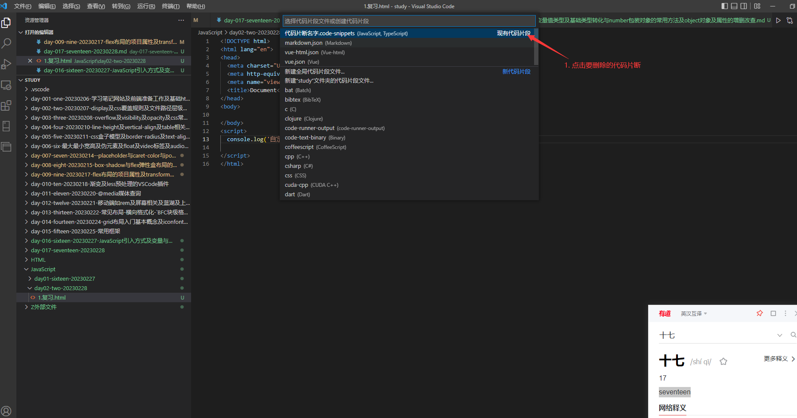
    3. 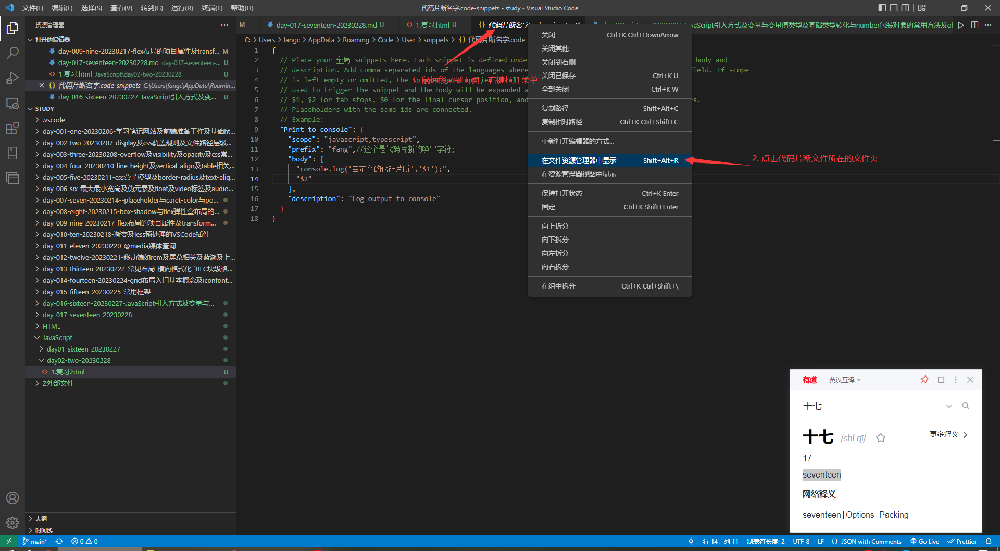
    4. 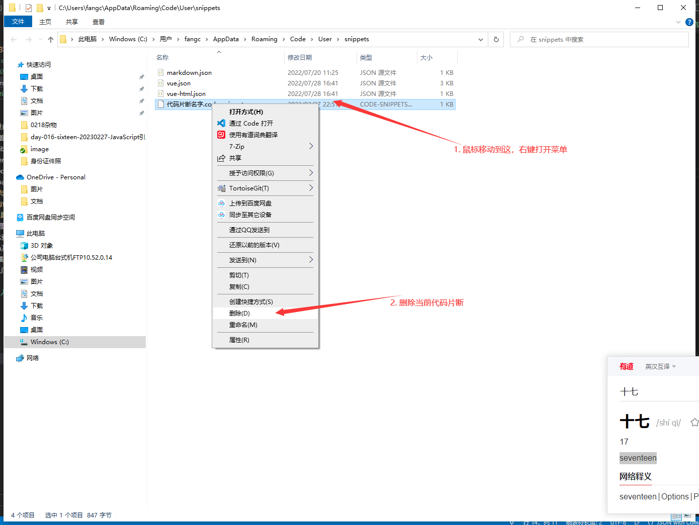
    5. 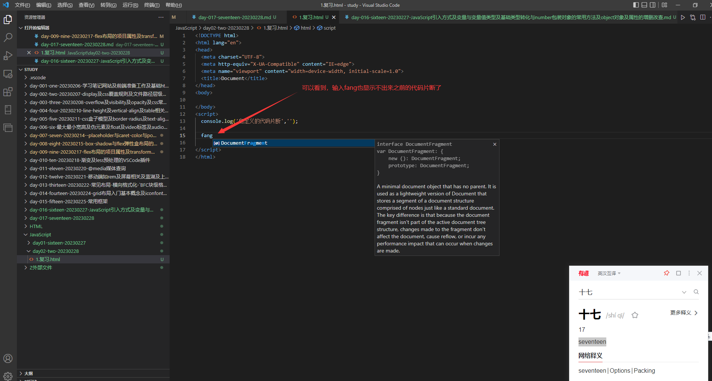

## 进阶参考

1. [JavaScript 开发规范](https://www.cnblogs.com/polk6/p/4660195.html#Menu3-FrameDev)
