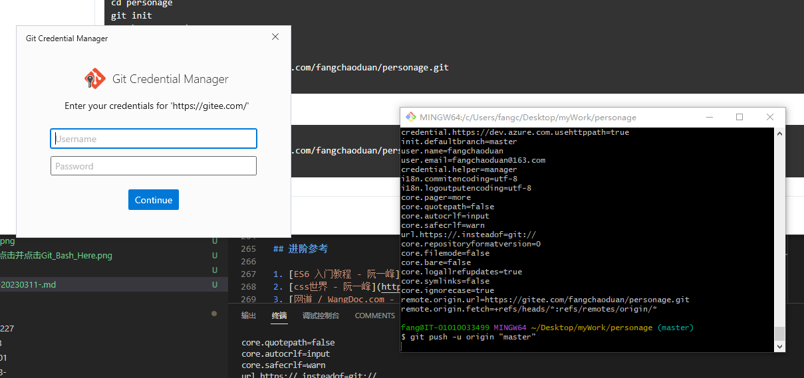

# day-024-twenty-four-20230311-复习-null和undefined场景总结-map的返回值思路-git安装及使用

## 复习

- 变量声明

    ```js
      var num;//undefined
      num=100;
    ```

- 在函数外面声明的变量，在外面和函数里面都可以用
- 形参和在函数里面声明的变量，只有里面才可以用
  - 一般函数里需不需要传参，得看场景
- 变量类型
  - 原始值/值/基本数据类型
    - number
      - NaN
    - string
    - boolean
    - null
    - undefined
    - symbol
      - Symbol()
    - bigint
      - BigInt()
  - 对象/引用数据类型
    - Object
      - {a:1,b:1}
    - Array
      - [10,1,12]
    - Function
    - Math
    - Date
    - ...
- 变量基本类型相关方法
  - Number()
    - parseInt('startHaveNumberString')
    - parseFloat('startHaveNumberString')
    - isNaN() 判断一个入参是不是有效数字
    - toFixed()
  - String()
  - Boolean()
- 关于对象
- typeof
  - 返回基本数据类型名称，就是'object'可能为null。
- 相等与全等
  - === 绝对相等、恒等、全等，没有数据类型转换
  - == 相等
- 隔行变色
- 函数
  - function fn(){}
  - var fn = function(){}
  - 函数里面的代码一定是调用后执行
  - 实参与形参
    - 调用必定为实参
    - 声明时必定为形参
      - 形参只能在函数里面用
  - 返回值
    - 返回了具体值或运算表达式，结果就是这些返回的
    - 没返回
  - 实参的接收
    - arguments
    - 形参接收
    - 扩展运算符接收
  - 自调用函数
  - 数组
    - 声明、查、增、删、改
    - 多维数组
    - 链式调用
    - 数组的方法
      - map的返回值思路

### 排序与去重回顾

#### 排序

```js
  const array = [1, 2, 3, 5, 5, 6, 9, 8, 7, 1, 0, 1, 2, 5, 4, 69, 87];
  console.log(array);

  const mySort1 = (ary = []) => {
    for (let i = 0; i < ary.length - 1; i++) {
      for (let j = i + 1; j < ary.length; j++) {
        if (ary[i] > ary[j]) {
          const item = ary[i];
          ary[i] = ary[j];
          ary[j] = item;
        }
      }
    }
    return ary;
  };
  console.log(mySort1(array.slice()), "冒泡排序");

  const mySort2 = (ary = []) => {
    if (ary.length <= 1) {
      return ary;
    }

    const res = [ary[0]];
    for (let i = 0 + 1; i < ary.length; i++) {
      const getItem = ary[i];
      for (let j = res.length - 1; j >= 0; j--) {
        if (getItem > res[j]) {
          res.splice(j + 1, 0, getItem);
          break;
        }

        if (j === 0) {
          res.splice(0, 0, getItem);
          break;
        }
      }
    }
    return res;
  };
  console.log(mySort2(array.slice()), "插入排序");

  const mySort3 = (ary = []) => {
    if (ary.length <= 1) {
      return ary;
    }

    const centerIndex = Math.floor(ary.length / 2);
    const centerItem = ary.splice(centerIndex, 1)[0];
    const minArray = [];
    const maxArray = [];
    for (let i = 0; i < ary.length; i++) {
      const getItem = ary[i];
      if (getItem < centerItem) {
        minArray.push(getItem);
      } else {
        maxArray.push(getItem);
      }
    }
    // return mySort3(minArray).concat(centerItem).concat(mySort3(maxArray));
    return [...mySort3(minArray), centerItem, ...mySort3(maxArray)];
  };
  console.log(mySort3(array.slice()), "快速排序");
```

#### 去重

```js
  const array = [1, 2, 3, 5, 5, 6, 9, 8, 7, 1, 0, 1, 2, 5, 4, 69, 87];
  console.log(array);
  
  const handerRepeat1 = (ary = []) => {
    for (let i = 0; i < ary.length; i++) {
      const getItem = ary[i];
      for (let j = i + 1; j < ary.length; j++) {
        if (getItem === ary[j]) {
          ary.splice(j, 1);
          j--;
          continue;
        }
      }
    }
    return ary;
  };
  console.log(
    handerRepeat1(array.slice()).sort((a, b) => a - b),
    "利用全等操作符===去重"
  );

  const handerRepeat2 = (ary = []) => {
    const obj = Object.create(null);
    for (let i = 0; i < ary.length; i++) {
      const getItem = ary[i];
      if (obj[getItem] === undefined) {
        obj[getItem] = i;
        continue;
      }

      ary[i] = ary[ary.length - 1];
      ary.length--;
      i--;
    }
    return ary;
  };
  console.log(
    handerRepeat2(array.slice()).sort((a, b) => a - b),
    "利用对象属性唯一性去重"
  );

  const handerRepeat3 = (ary = []) => {
    for (let i = 0; i < ary.length; i++) {
      const getItem = ary[i];
      if (ary.indexOf(getItem, i + 1) === -1) {
        continue;
      }

      ary[i] = ary[ary.length - 1];
      ary.length--;
      i--;
    }
    return ary;
  };
  console.log(
    handerRepeat3(array.slice()).sort((a, b) => a - b),
    "利用includes()及indexOf()等方法去重"
  );
```

## null和undefined场景总结

- null的场景
  1. 对象属性伪删除 `obj.property=null`
  2. 三元占位 `a<10?a=10:null`
  3. 获取不到元素，也是null `document.getElementById('notHaveIdName')`
  4. 上一个兄弟节点或下一个兄弟节点如果没有，也是null `document.head.previousElementSibling`
  5. 不确定一个变量具体数据类型的时候，可以先赋值为null，后面可以再给具体的值 `var variable = null`
- undefined的场景
  1. 声明变量没有赋值 `var num`
  2. 形参没有实参对 `(fang=(a,b,c)=>{return 5})(1,2);//形参c此时为undefined`
  3. 函数调用没有return返回值是undefined `var fang = (fang=(a)=>{})(1);`
  4. 函数调用写了return，没有内容，也是undefined `var fang = (fang=(a)=>{return})(1);`
  5. 获取对象中一个不存在的属性名，值是undefined `obj.notProperty`

## map的返回值思路

```js
function map(theArray = [], callback = () => {}) {
  const res = [];
  for (let i = 0; i < theArray.length; i++) {
    const item = theArray[i];
    const index = i;
    const selfArray = theArray;
    const callbackReturn = callback(item, index, selfArray);
    res[res.length] = callbackReturn;
  }
  return res;
}
```

## 案例

### 随机抽奖

```html
<!DOCTYPE html>
<html lang="en">
  <head>
    <meta charset="UTF-8" />
    <title>复习</title>
  </head>
  <body>
    <div class="box" name="fang"></div>
  </body>
</html>

<script>
  const fang = document.getElementsByName("fang")[0];
  console.log(fang);
  function getRandomString(max = 4) {
    let res = "";
    for (let i = 0; i < max; i++) {
      res += Math.floor(Math.random() * (10 - 0) + 0);
    }
    return res;
  }

  const box = document.getElementsByClassName("box")[0];
  box.innerText = getRandomString();
  const time = 1000;
  const timer1 = setInterval(() => {
    box.innerText = getRandomString();
  }, time);
  setTimeout(() => {
    clearInterval(timer1);
  }, 10 * time);
</script>
```

### 倒计时

```html
<!DOCTYPE html>
<html lang="en">
  <head>
    <meta charset="UTF-8" />
    <title>复习</title>
    <style>
      .box {
        margin: 50px auto;
        width: 400px;
        line-height: 100px;
        font-size: 20px;
        border: 1px solid red;
        text-align: center;
        color: pink;
        user-select: none;
      }
    </style>
  </head>
  <body>
    <div class="box"></div>
  </body>
</html>

<script>
  const box = document.getElementsByClassName("box")[0];
  function countDown(timeString = "2024/02/10 00:00:00") {
    const end = new Date(timeString).getTime();
    const start = new Date().getTime();

    let remainder = end - start;

    const milliseconds = remainder % 1000;
    remainder = remainder - milliseconds;

    const secondsNumber = 1000;
    const seconds = (remainder / secondsNumber) % 60;
    remainder = remainder - seconds * secondsNumber;

    const minutesNumber = 1000 * 60;
    const minutes = (remainder / minutesNumber) % 60;
    remainder = remainder - minutes * minutesNumber;

    const hoursNumber = 1000 * 60 * 60;
    const hours = (remainder / hoursNumber) % 24;
    remainder = remainder - hours * hoursNumber;

    const dateNumber = 1000 * 60 * 60 * 24;
    const date = (remainder / dateNumber) % 365;
    remainder = remainder - date * dateNumber;

    const yearNumber = 1000 * 60 * 60 * 24 * 100;
    const year = (remainder / yearNumber) % 100;
    remainder = remainder - year * yearNumber;

    const res = `距离2024年春节还有 ${date}天${hours}小时${minutes}分${seconds}秒`;
    return res;
  }
  // console.log("2024/02/10 00:00:00");
  box.innerHTML = countDown();
  setInterval(() => {
    box.innerHTML = countDown();
  }, 50);
</script>
```

## git安装及使用

1. 找到[git官网](https://git-scm.com/)
2. 点击对应版本的下载，进入新页面

3. 安装，一直点击下一步。直到安装完成
4. 在特定文件夹里右键点击并点击`Git_Bash_Here`。

5. 在`Git_Bash`里查看`当前git版本`

    ```js
    git --version
    ```

    - 实际上能打开`Git_Bash`就基本上算是安装完成了。
      - 查看版本的目的是确定`当前git版本`是否就是自己安装的。并顺便看看`git指令`是否正常。

### gitee

1. [gitee官网](https://gitee.com/)注册一个帐号
2. [gitee邮箱绑定](https://gitee.com/profile/emails)
3. 在`gitee.com`上新建仓库
4. 配置`git全局属性`，一般只用设置一次。如果之前已经配置了，这步不用做。

    ```js
    //设置用户全局名称，提交代码时用到
    git config --global user.name "用户名一般用英文单词"
    //设置全局邮箱，提交代码时也用到
    git config --global user.email "邮箱名一般不用QQ邮箱@163.com"
    查看当前自己当前配置，可以用来看自己的配置过那些全局设置。
    git config --list
    ```

5. 查看自己`当前配置`，可以用来看自己配置过那些`当前配置`。

    ```js
    //查看当前配置，可以用来看自己在当前目录中的配置过那些设置。
    git config --list
    ```

    - 因为有时候配置太久了。多少会忘记是否已经配置好了，所以打印看一下。

6. 在本地创建`新项目根目录`或直接进入`旧项目根目录`，`git bash here`打开`git命令终端窗口`
7. 在项目根目录上`git init`新建`git仓库`
8. `git add .`进行`保存`
9. `git commit -m '本次提交的注释说明'`进行`提交`
10. 按要求进行配置

    - 如果是`第一次连接gitee`，那么可能在`git remote .....`这一步里要输入帐号与密码，按提示直接输入`gitee.com的帐号与密码`就可以了。
        
      - `git remote -v`  查看有没有关联上
    - `git push -u origin 'master'` 把本地代码推送到远程仓库
11. 修改了代码，想推上去，重新执行`git add .`与`git commit -m '本次提交的注释说明'` 进行`本地提交`
12. `git push` 重新推送`本地最新的提交`到`远程仓库`

### git流程说明汇总

#### 想要将自己本地的文件夹 推送到git上去

  1. 在本地创建`文件夹a`，写代码
  2. 在`文件夹a`里面`git init`
  3. `git add .`  保存
  4. `git commit -m '注释'`
  5. 去`gitee网站`里面创建仓库（右上角有个加号）
  6. 在`git bash here`那里输入`git remote .....`  (`git remote -v`  查看有没有关联上)
  7. `git push -u origin 'master'`(第一次需要一大堆)
  8. 修改了代码，想推上去，重新执行`3`与`4`
  9. `git push`

#### 想把别人代码拿到

前提: 别人会把仓库地址给你`仓库是公开的`

  1. 右键 `git bash here`
  2. `git clone 地址`
  3. 如果人家修改了代码，想要最新的代码  `git pull`

### git报错

```js
$ get add .
bash: get: command not found //表示命令找不了，大概率是文字拼错了。
```

如果不懂，直接把报错命令`bash: get: command not found`复制去百度或谷歌去找。

git终端类的，一般是以空格为分隔。所以要注意不同意思之间的单词要用空格分隔开来。

## 进阶参考

1. [ES6 入门教程 - 阮一峰](https://es6.ruanyifeng.com/)
2. [css世界 - 阮一峰](https://es6.ruanyifeng.com/)
3. [网道 / WangDoc.com - ES6 入门教程 - 阮一峰](https://wangdoc.com/es6/)
4. [gitee官网](https://gitee.com/)
